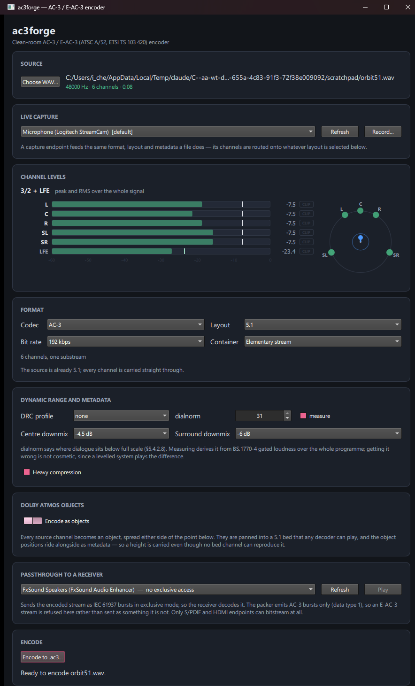
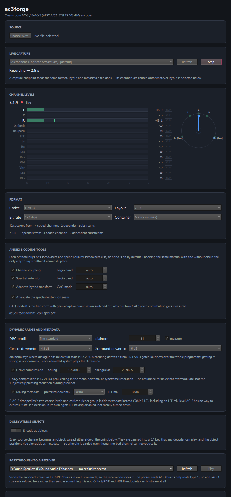
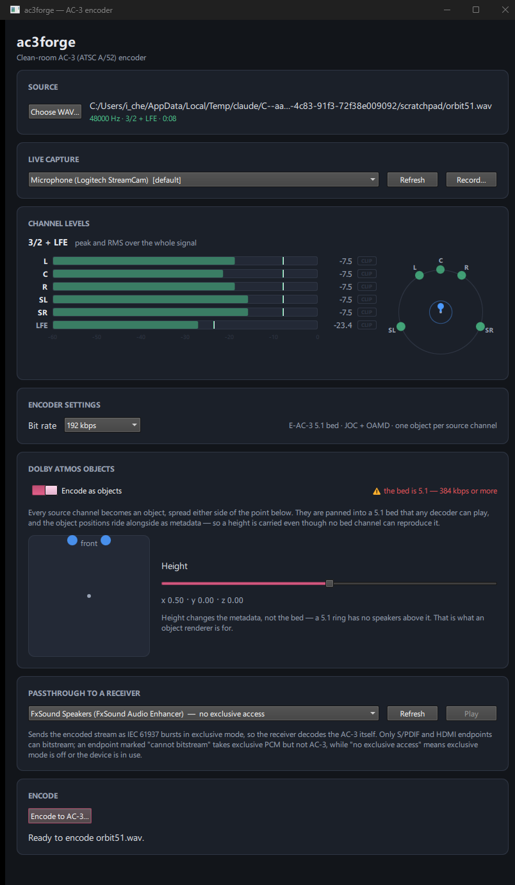
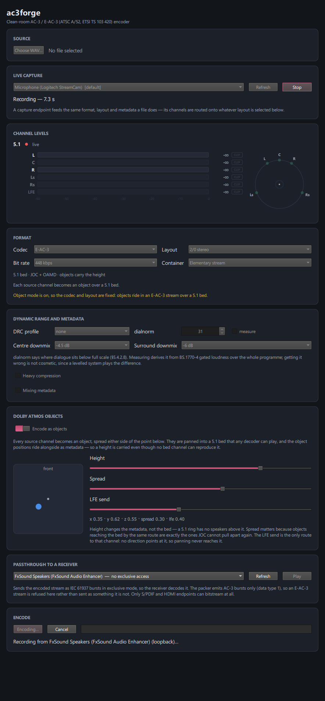

# ac3forge GUI — design brief

An input document for a design pass over the ac3forge desktop application. It describes what the
application is for, what it shows today, how people move through it, and what still has to be
accommodated. It does not propose a design.

**Which version this describes.** The GUI gained most of the codec surface it had been missing in
"Both front ends reach the whole codec" (`dcaca85`), merged since. This brief describes that
build — a substantially larger interface than the earlier seven-card version — and predates the
live-audio commands (`live`, `monitor`) and per-object Atmos motion covered elsewhere in these
docs, neither of which is wired into the GUI yet. Every screenshot here is of the build described
above.

---

## 1. What the application is for

ac3forge encodes audio into Dolby formats. Someone brings in audio — a WAV file on disk, or a live
feed from a microphone or from whatever the machine is playing — and gets back an encoded stream:
AC-3 (Dolby Digital), or Dolby Digital Plus, optionally carrying Dolby Atmos objects. Before
encoding, they can place sounds at points in a three-dimensional room, so the stream carries position
metadata alongside the audio.

The encoder is a clean-room implementation written from the published standards (ATSC A/52, ETSI TS
103 420), so it is also a tool for checking that implementation: what did the encoder actually do to
this signal, and does the result play back correctly.

### Who uses it

- **Someone producing a Dolby stream from existing audio** — a mix that needs to ship as AC-3 or
  E-AC-3, at a chosen bit rate and channel layout, with correct loudness and downmix metadata.
- **Someone authoring spatial audio** — placing sources in a room and encoding them as Atmos objects
  over a conventional bed, then checking the result decodes.
- **Someone working on the codec itself** — encoding known material with a specific coding tool on or
  off, watching per-channel levels, and bitstreaming the result to a hardware receiver to confirm a
  real decoder accepts it.

All three care about exact figures. The interface is read as much as it is operated: levels in dBFS,
bit rates in kbps, band edges as integers, channels under their standard names.

---

## 2. Current-state inventory

### The window

A single `ApplicationWindow`, 900 × 940 by default, minimum 720 × 560, containing one vertically
scrolling column of nine titled cards. There is no navigation, no tabs, no menu bar and no second
window — the entire application is this one column. Qt Quick Controls is pinned to the **Fusion**
style in `main.cpp` so that controls render identically on every platform rather than adopting the
native Windows look.

*Default state with a 5.1 WAV loaded. The window has been enlarged to 900 × 1500 to fit the content;
at the default 940 px height everything from Dynamic range downwards is below the fold. The Annex E
card is absent here because AC-3 does not offer those tools.*

### The cards, in order

**1. Source.** A `Choose WAV…` button, the selected path (middle-elided), and a summary line —
`48000 Hz · 6 channels · 0:08`. It reports the channel *count* rather than a layout name, because the
output layout is now chosen separately and need not match the file.

**2. Live capture.** A dropdown of WASAPI endpoints — microphones and playback-device loopbacks, the
default marked `[default]` — plus `Refresh` and a `Record…` button that becomes a highlighted `Stop`
while running, with a monospace `Recording — 2.9 s` line beneath. A note explains that a capture
endpoint feeds the same format, layout and metadata a file does, and that its channels are routed
onto whichever layout is selected below.

**3. Channel levels.** The layout name (`3/2 + LFE`, `7.1.4`) or `no source`; a red dot and the word
`live` while a run is in flight, otherwise `peak and RMS over the whole signal`. Then one meter row
per channel, a −60…0 dB tick scale, and the soundfield view to the right.

The meters now follow the **coded** channels rather than the speakers, which is why 7.1.4 draws
fourteen rows for twelve speakers. A bed channel that a dependent substream replaces is labelled
`Ls (bed)` so that a 7.1 display does not show `Ls` twice with different levels and no way to tell
them apart. A channel the routing feeds nothing is drawn at 45% opacity and reads `-∞`, so "correctly
silent" is distinguishable from "meter wired to nothing".

**4. Format.** Four dropdowns in a four-column grid — Codec (AC-3, E-AC-3), Layout, Bit rate,
Container (Elementary stream, Matroska). The layout list is filtered by codec: AC-3 offers mono,
stereo and 5.1; E-AC-3 adds 7.1, 5.1.2, 5.1.4 and 7.1.4. The bit-rate list likewise comes from the
plan rather than being a fixed set. Below the grid, two lines of generated description — what the
layout costs (`12 speakers from 14 coded channels · 2 dependent substreams`) and what the routing
will do with this particular source (`The source is already 5.1; every channel is carried straight
through.`). In object mode a third, amber line says the codec and layout are fixed.

**5. Annex E coding tools.** Present only when the codec offers them. Three checkboxes, each with a
spin box that reads `auto` at its lowest value: Channel coupling (begin band 0–15), Spectral
extension (begin band 0–7), Adaptive hybrid transform (GAQ mode 0–3). Turning on spectral extension
adds a further checkbox for attenuating the seam. At the foot of the card, the equivalent `ac3cli`
tools token in monospace — `cpl+spx+aht` — so a setting found here can be reproduced on the command
line.

**6. Dynamic range and metadata.** The densest card. A DRC profile dropdown (`none` plus five
profiles); a dialnorm spin box, 1–31, disabled by a `measure` checkbox that derives it from BS.1770-4
loudness instead; centre and surround downmix dropdowns. A `Heavy compression` checkbox reveals a
ceiling spin box counted in tenths of a decibel (so the default −0.5 dBFS survives) and a
dialogue-level spin box. For E-AC-3 only, a `Mixing metadata` checkbox reveals a preferred-downmix
dropdown and an LFE mix spin box that reads `off` at −1 and `10 dB` at 0. Three paragraphs of
explanation, two of them conditional.

*E-AC-3 at 7.1.4 with all three Annex E tools, heavy compression and mixing metadata switched on,
during a live capture. Fourteen meter rows for twelve speakers; the twelve channels a stereo capture
cannot fill are dimmed and read −∞. This is the interface at its fullest — roughly 1,950 px tall, and
still cut off at the bottom of this capture.*

**7. Dolby Atmos objects.** An `Encode as objects` switch, an object count (`6 objects + the bed's
LFE`), and a warning when the bit rate is below 384 kbps because the bed is always 5.1. When on: a
190 × 190 plan view of the room with one marker per object, and three sliders — Height (−1…1), Spread
(0…0.5) and LFE send (0…1) — above a five-value monospace readout.

*Object mode with the same 5.1 file: six objects over a 5.1 bed. All six markers sit on the front
wall at the default y of 0.00, overlapping each other and the "front" label.*

**8. Passthrough to a receiver.** A dropdown of render endpoints, each annotated with what it will
accept — `AC-3 ready`, `cannot bitstream`, `no exclusive access` — plus `Refresh` and `Play`. The
explanatory text now states that the packer emits AC-3 bursts only (data type 1), so an E-AC-3 stream
is refused here rather than sent as something it is not.

**9. Encode.** The primary button, whose label follows the plan — `Encode to .ac3…`, `.ec3` or
`.mkv`. While encoding, a `Cancel` button and a progress bar. Under them, a single line of status
text — still the only place the application reports anything.

### Shared components

- **`Card.qml`** — a titled panel: surface fill, 1 px border, 10 px radius, 18 px padding, small
  uppercase heading. Every screen region is one of these.
- **`ChannelMeter.qml`** — one row: channel name (58 px, elided from the left), the bar track, a dB
  readout (46 px) and a `CLIP` box (30 px). Inside the track, an RMS fill at 55% opacity, a 2 px
  bright peak edge, and a 1 px white hold marker that lags the peak downwards. Colour is green, amber
  above −6 dBFS, red above −1 or once a sample has hit full scale. Bar positions and printed numbers
  both come from the C++ analysis layer, so they cannot disagree.
- **`SoundfieldView.qml`** — a 176 × 176 plan view of the loudspeaker ring, listener at the centre
  facing up, each speaker placed at its ITU-R BS.775 azimuth and brightening with its level; the LFE
  as a halo at the centre; an arrow for the computed energy vector. **Unchanged by the recent work** —
  it is still a single flat horizontal ring, so the height channels of 5.1.2, 5.1.4 and 7.1.4 appear
  as meter rows with no position.
- **`Theme.qml`** — a singleton holding eleven colours, three spacing values (gap 12, pad 18, radius
  10) and three font sizes (22 / 14 / 12). A single dark palette of hard-coded literals. No light
  theme, and no scheme switch.

### Where the current interface is weak

Stated plainly, as input to the design pass.

- **The theme only reaches half the interface.** `Theme.qml` styles the custom-drawn parts — meters,
  soundfield, room view, card chrome — and its accent is blue (`#4c9aff`). Every standard control is
  drawn by Fusion's own palette, which nothing sets, so switches, checkboxes, sliders and progress
  bars come out pale pink. Two unrelated accent colours are visible in every screenshot here. This is
  the single most visible inconsistency and it is not intentional.
- **Length.** At 900 px wide the interface is about 1,500 px tall in its default state, 1,700 px with
  object mode on and roughly 1,950 px with E-AC-3 tools and metadata expanded — close to twice the
  usable height of a 1080p display. It is one scroll column with no grouping above the card level.
- **Disclosure is one-way and inline.** Ticking a box injects controls *and* a paragraph into the
  middle of the column, pushing everything below it down. There is no way to collapse a card that is
  configured and no longer interesting.
- **The two generated lines under the Format grid can restate each other.** In the 7.1.4 capture state
  they read `12 speakers from 14 coded channels · 2 dependent substreams` and `7.1.4 · 12 speakers
  from 14 coded channels · 2 dependent substreams`.
- **A disabled control can disagree with the text beneath it.** In object mode the Layout box is
  greyed but keeps showing the source-derived layout — `2/0 stereo` for a stereo capture — while the
  line below it and the bed itself are 5.1.
- **Objects default to the front wall.** `y = 0.00` puts every marker on the top edge of the room
  view, overlapping the only axis label; with six objects they overlap into a smear.
- **The room view is under-described**, and now has three sliders beside it whose ranges and units are
  invisible — Height runs −1…1, Spread 0…0.5, LFE send 0…1, and only the readout hints at any of it.
- **Explanatory prose has grown with the control count.** The nine cards carry roughly 450 words of
  body text — most of it always on screen, the rest appearing with the option it explains — and none
  of it collapses once read.
- **One status line for everything.** Progress, rejected settings, errors and success all land in the
  same sentence at the bottom of a long scroll.
- **The soundfield view has not kept up with the meters.** Meters went to fourteen rows; the ring did
  not change, so four of those channels have no spatial representation at all.

---

## 3. User journeys

### A. Encode a file

1. `Choose WAV…`, pick a file. The card fills in with sample rate, channel count and duration.
2. Channel levels shows peak and RMS for the whole file, plus the soundfield.
3. In Format, choose codec, layout, bit rate and container. The two generated lines say what that
   costs and what will happen to this particular source.
4. Optionally set coding tools and metadata.
5. Scroll to `Encode to .ac3…`, which opens a save dialog with the suffix already correct.
6. Name the file and accept. A progress bar runs; the status line reports frames and size.

**Awkward today:** the file must be named before any encoding happens, so a run cannot be tried and
then kept. By step 5 the button is a long way down the column — and so is the status line that says
whether it worked. Steps 3 and 4 together are about twenty controls with no sense of which matter.

### B. Capture and encode live

1. Pick an endpoint — a microphone, or a playback device's loopback entry.
2. Set the format as in journey A; the endpoint's channels will be routed onto whatever layout is
   chosen, so a stereo microphone can be encoded as 7.1.4 with ten channels left silent.
3. Press `Record…`, which immediately opens a save dialog.
4. Name the file and accept. Recording starts, the elapsed time counts up, the meters go live.
5. Press `Stop`. The status line reports frames written, dropped and silence-filled.

**Awkward today:** the meters only run once recording has started, so there is still no way to check
that an endpoint is producing signal — or to set a level — before committing to a filename and a
take. The consequences of routing a narrow source onto a wide layout are only visible after the fact,
as a column of dimmed meters.

### C. Place objects in space and encode them

1. Load a file, or choose a capture endpoint.
2. Turn on `Encode as objects`. Codec and layout are fixed to E-AC-3 over a 5.1 bed and their
   dropdowns grey out; the card reports how many objects the source will produce.
3. Drag in the plan view to place the source; use Height for the vertical axis, Spread to control how
   far apart the objects sit, LFE send to reach the one channel panning cannot.
4. If the bit rate is under 384 kbps, a warning appears — the bed is 5.1 whatever the source was.
5. Encode. The output is `.ec3`, or `.mkv` if that container is chosen.

**Awkward today:** the position is still a single static point for the whole file — objects cannot
move, which is most of what object audio is for. Spread is a single number applied to an even fan, so
individual objects cannot be placed independently. The bit-rate warning is in the objects card while
the control it refers to is in Format, two cards above. The meters continue to show the 5.1 bed rather
than the objects — deliberately, since it is what a decoder ignoring the objects would play — but
nothing on screen says so.

---

## 4. What the design must accommodate

Most of what was previously missing has now landed, and the list below is what a redesign has to hold
**and** what is still to come.

### Already in the interface, and needing a home

- Codec choice, AC-3 or E-AC-3.
- Seven channel layouts, mono through 7.1.4, filtered by codec.
- Annex E coding tools as toggles with band edges and GAQ mode.
- The full DRC and metadata group — profile, dialnorm (set or measured), heavy compression with
  ceiling and dialogue target, centre and surround downmix, mixing metadata with preferred downmix
  and LFE mix level.
- Object mode with position, spread and LFE send.
- Elementary-stream and Matroska output.
- Live per-channel metering, up to fourteen coded channels, and the soundfield view.

That is roughly forty controls in one scrolling column. **Organising them is the central design
problem**, more than any individual screen.

### Still to come

- **Object motion in three dimensions.** Objects are placed once and stay there. Trajectories over
  time are the largest single addition still outstanding, and the one most likely to need a surface
  of its own — a time axis, per-object paths, and a way to scrub and preview them.
- **S/PDIF-wrapped WAV output.** The container dropdown offers elementary stream and Matroska; the
  library and the command-line tool can also wrap a stream as playable PCM in a WAV, and the GUI
  cannot.
- **A light theme**, and a Fusion palette aligned to whichever theme is active.
- **Height in the soundfield view**, so 5.1.2, 5.1.4 and 7.1.4 are legible as more than a longer list
  of meters.

---

## 5. Constraints the designer must respect

- **Qt Quick / QML.** The interface is QML with Qt Quick Controls, pinned to the Fusion style so that
  layout does not reflow across platforms. Anything proposed must be buildable from Qt Quick
  primitives; there is no web layer. Note that restyling standard controls means either overriding the
  Fusion palette or supplying custom control styles — today neither is done.
- **Desktop, Windows first.** Mouse and keyboard, resizable window, 720 × 560 minimum. Live capture
  and receiver passthrough go through `ac3::capture`/`ac3::sinks`, which is WASAPI on Windows and
  ALSA on Linux behind the same API — no longer Windows-exclusive at the library level, though
  `ac3gui` itself is still built only on Windows by default (it does build and run on Linux with
  `-DAC3FORGE_BUILD_GUI=ON` and a Qt kit; see [Portability](../README.md#portability)).
- **Light and dark themes.** Only dark exists today. Both are required, which means colour decisions
  must survive inversion — particularly the meter colours, where green/amber/red carry meaning.
- **Real-time metering.** The controller publishes a level snapshot about 30 times a second (one per
  encoded frame) and QML animates between snapshots over 40–90 ms, so the scene needs to render at 60
  fps without dropping frames. With fourteen meters plus the soundfield animating together, anything
  expensive per frame — shadows, blurs, large repaints behind the meters — costs directly.
- **This is a technical tool.** Users want exact numbers where they can be read at a glance: levels to
  0.1 dBFS, bit rates in kbps, band edges as integers, coordinates to two decimals. Numeric readouts
  are set in a monospace face so that changing digits do not shift position. Density is a feature
  here; aesthetic decisions must not cost precision.
- **Parity with the command line is deliberate.** The GUI and `ac3cli` are generated from the same
  tables, and the Annex E card prints the exact token that reproduces its state. Whatever replaces it
  should keep a settings-to-command-line path.

---

## 6. Open questions for the designer

> **Answered.** These eleven questions, plus five later change prompts (dynamic channel counts, real
> object motion, the basic/advanced split, the live demo scenario, and the channel-picker constraint
> model), are resolved by [`docs/design/handoff-workbench/README.md`](design/handoff-workbench/README.md)
> — the two-pane workbench redesign, spec'd and prototyped on `feature/gui-redesign-workbench`. That
> prototype is a static HTML/CSS reference for an implementing engineer to build from, explicitly not
> production code; `src/gui/qml/Main.qml` here is still the nine-card layout Section 2 describes. The
> questions below are kept as a record of what was asked, not as open items.

1. **How should forty controls be organised?** One dense panel, progressive disclosure, a separate
   configuration surface, or presets that can be opened up? This is the main question.
2. **What is the default level of expertise?** Should Annex E tools and the metadata group be visible
   by default, or behind an advanced mode? A codec developer wants them first; someone encoding a mix
   may never touch them.
3. **How should the input be modelled?** File and live capture are alternatives presented as adjacent
   cards. Is there one "input" with a source selector?
4. **How is object motion authored?** Objects need trajectories over time. Does the room view gain a
   timeline, is there a separate surface, and how do a dozen objects stay legible at once?
5. **Can objects be placed independently?** Today one point plus a spread fans them out evenly. Is
   per-object placement the target, and if so what happens to the spread control?
6. **How does the soundfield view represent height** for 5.1.2, 5.1.4 and 7.1.4? A flat ring cannot
   show a ceiling layer.
7. **How should coded-versus-rendered channels be presented?** Fourteen meters for twelve speakers is
   correct and useful to a codec developer, and probably confusing to everyone else. Is that a mode?
8. **How should routing consequences be shown before the fact?** Encoding a stereo source as 7.1.4
   leaves ten channels silent. Today that is a sentence in Format and a column of dim meters
   afterwards.
9. **Should encoding be a modal action or a job?** One button, one progress bar and one status line.
   With this many options, is there a queue, a history, or a result view?
10. **Where does feedback belong?** Errors, progress, warnings and results share one line of text at
    the bottom of a very long column.
11. **How much explanation stays on screen?** Roughly 450 words of it, most always visible. Which is
    needed at every use, and which belongs in a tooltip, a first-run state, or documentation?

---

## Appendix: how the screenshots were made

Real captures of a real build — `ac3gui` from `claude/youthful-hermann-549468` (`dcaca85`), rebuilt
with MSVC against Qt 6.8.3, Debug.

The application has a built-in headless self-check mode (`--smoke`, `--smoke-record`) that drives the
real controller and the real QML, then grabs the window through `QQuickWindow::grabWindow()`. It
accepts trailing `prop=value` tokens applied through Qt's property system — the same path a QML
binding writes through — so a run can be put into a specific state and photographed. Images 02 and 04
were made that way, with the window enlarged from outside the process while the run was in flight so
that the grab caught every card rather than the top of a 940 px window. Each run reported its own
state (image 02: 14 meters for 14 channels, 133 level publishes while live), so the scene is known to
have rendered rather than merely started.

Images 01 and 03 were captured from the running windowed application via `PrintWindow`, because they
need a loaded source file, which the smoke modes do not take alongside a capture run. Image 03 was
produced by clicking the object switch through a synthesised mouse message.

Two notes on what the images do and do not show:

- Under the offscreen platform plugin, text renders as empty boxes unless `QT_QPA_FONTDIR` is set, and
  even then the font fallback is not the one the application uses. Every screenshot here was taken
  under the normal Windows platform plugin, so the typography is what a user sees.
- In images 02 and 04 the capture dropdown still shows the default microphone while the meters are fed
  from a loopback endpoint, and the Source card reads "No file selected". Both are artefacts of the
  headless harness, which passes a device index directly and does not load a file — not defects in the
  interface.

*Image 04: object mode with the sliders at non-default values, driven from a capture endpoint. Note
the Layout box reading `2/0 stereo` while the line below it and the bed are 5.1, and the meters at −∞
because nothing was playing on the machine at that moment.*
