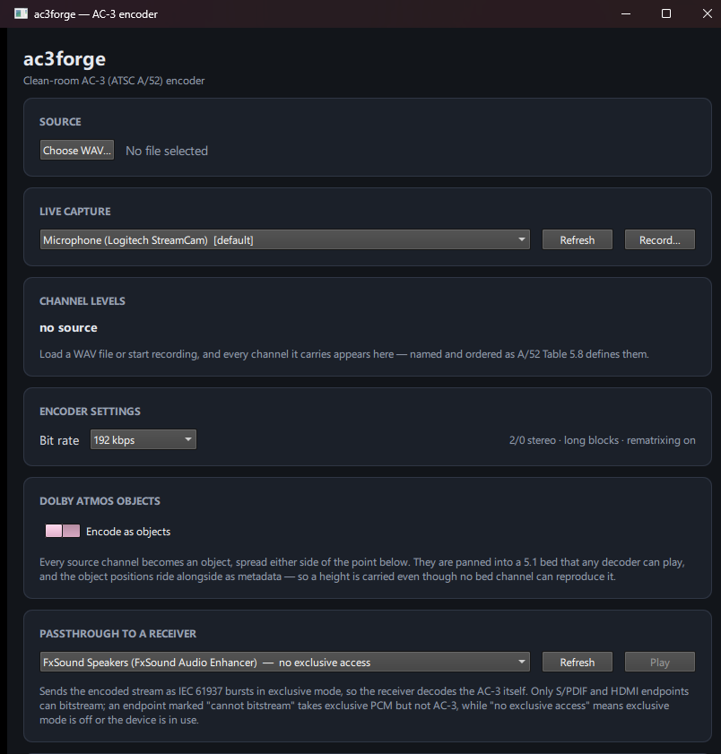
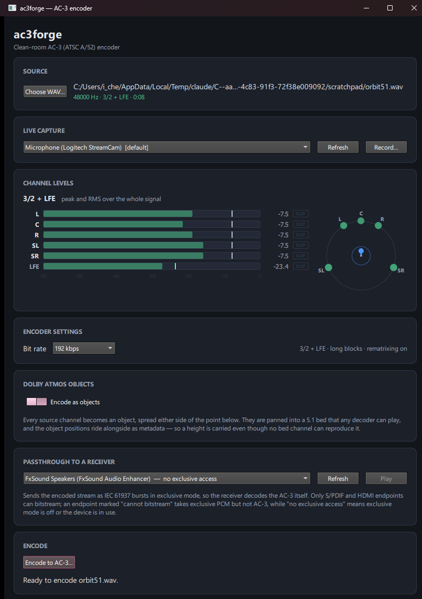
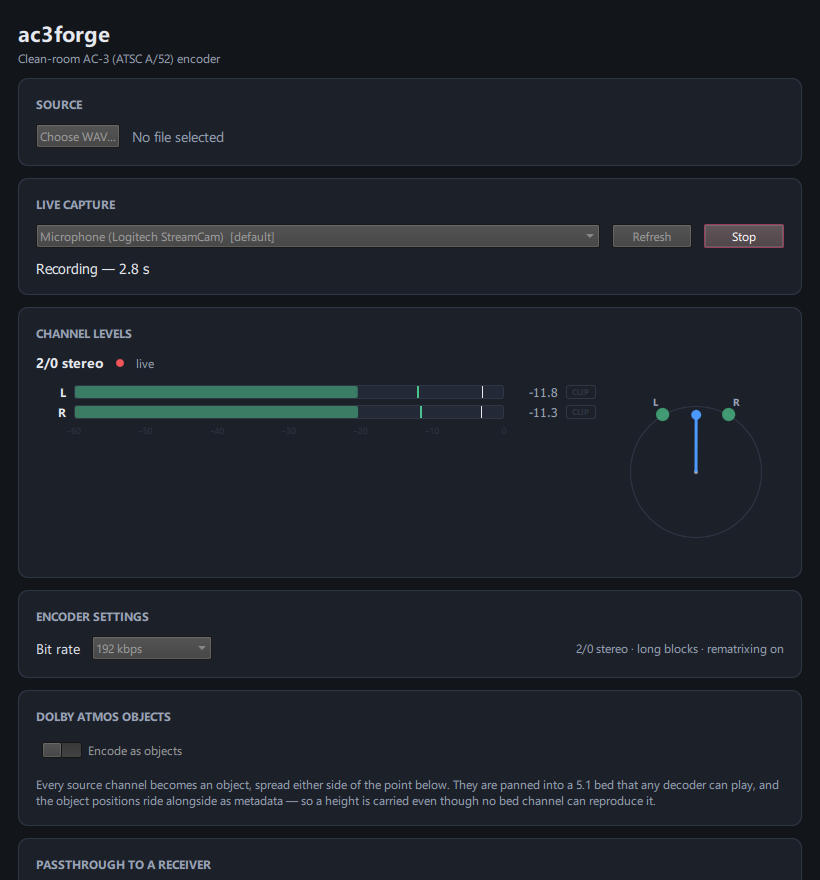

# ac3forge GUI — design brief

An input document for a design pass over the ac3forge desktop application. It describes what the
application is for, what it shows today, how people move through it, and what the library behind it
is about to require of the interface. It does not propose a design.

Everything in the "current state" section describes the GUI as of `master` (`acd2c78`, GUI last
touched by `40be082`). The screenshots are of that build. A separate workstream is adding several of
the capabilities listed under *What the design must accommodate*; at the time of writing none of it
had landed, so treat that section as incoming work rather than a wish list.

---

## 1. What the application is for

ac3forge encodes audio into Dolby formats. Someone brings in audio — a WAV file on disk, or a live
feed from a microphone or from whatever the machine is playing — and gets back an encoded stream:
AC-3 (Dolby Digital), or Dolby Digital Plus carrying Dolby Atmos objects. Before encoding, they can
place sounds at points in a three-dimensional room, so the encoded stream carries position metadata
alongside the audio.

The encoder is a clean-room implementation written from the published standards (ATSC A/52, ETSI TS
103 420), so it is also a tool for checking that implementation: what did the encoder actually do to
this signal, and does the result play back correctly.

### Who uses it

- **Someone producing a Dolby stream from existing audio** — a mix that needs to ship as AC-3 or
  E-AC-3, at a chosen bit rate, with correct loudness and downmix metadata.
- **Someone authoring spatial audio** — placing sources in a room and encoding them as Atmos objects
  over a conventional bed, then checking the result decodes.
- **Someone working on the codec itself** — encoding known material, watching per-channel levels, and
  bitstreaming the result to a hardware receiver to confirm a real decoder accepts it.

All three care about exact figures. The interface is read as much as it is operated: levels in dBFS,
bit rates in kbps, channel assignments by their standard names.

---

## 2. Current-state inventory

### The window

A single `ApplicationWindow`, 820 × 880 by default, minimum 640 × 560, containing one vertically
scrolling column of seven titled cards. There is no navigation, no tabs, no menu bar, and no second
window — the entire application is this one column. Qt Quick Controls is pinned to the **Fusion**
style in `main.cpp`, so the controls render identically on every platform rather than adopting the
native Windows look.

*Initial state at the default 820 × 880 window. Six of the seven cards are visible; the seventh —
Encode — is below the fold.*

### The cards, in order

**1. Source.** A `Choose WAV…` button opening a file dialog, the selected path (middle-elided), and a
summary line: `48000 Hz · 3/2 + LFE · 0:08`, shown in green when the file is usable. Accepts WAV with
1–6 channels at 32, 44.1 or 48 kHz; anything else loads but reports why it cannot be encoded. The
channel count picks the coding mode (1 → 1/0, 2 → 2/0, 3 → 3/0, 4 → 2/2, 5 → 3/2, 6 → 3/2 + LFE).

**2. Live capture.** A dropdown of WASAPI endpoints — microphones and playback-device loopbacks, the
default one marked `[default]` — plus `Refresh` and a `Record…` button that becomes a highlighted
`Stop` while running. During a recording, a monospace `Recording — 2.8 s` line appears. If no
endpoints are found, the card explains what a loopback entry is instead.

**3. Channel levels.** The layout name (`3/2 + LFE`) or `no source`; a red dot and the word `live`
while a run is in flight, otherwise `peak and RMS over the whole signal`. Below it, one meter row per
channel and a −60…0 dB tick scale. To the right, a soundfield view, shown whenever the layout has two
or more full-bandwidth channels. With nothing loaded, the card holds a sentence of placeholder text.

**4. Encoder settings.** One control: a bit rate dropdown with a fixed list of ten AC-3 values (96,
128, 160, 192, 224, 256, 320, 384, 448, 640 kbps). Beside it, a read-only summary of what the encoder
will do — `3/2 + LFE · long blocks · rematrixing on`, or in object mode `E-AC-3 5.1 bed · JOC + OAMD ·
one object per source channel`. The word "settings" is currently doing a lot of work for a single
combo box.

**5. Dolby Atmos objects.** An `Encode as objects` switch, a paragraph explaining what object mode
does, and — when the switch is on — a 190 × 190 plan view of the room, a Height slider, and a
monospace `x 0.50 · y 0.00 · z 0.00` readout. The plan view is click-and-drag: x runs left to right,
y runs front to back. Every source channel becomes one object, spread ±0.15 either side of the chosen
point. A warning appears next to the switch when the bit rate is below 384 kbps, because the bed is
always 5.1 regardless of what the source was.

**6. Passthrough to a receiver.** A dropdown of render endpoints, each annotated with what it will
accept — `AC-3 ready`, `cannot bitstream`, or `no exclusive access` — plus `Refresh` and `Play`.
Sends the encoded stream as IEC 61937 bursts in exclusive mode so the receiver does the decoding.
Enabled only once an encode has actually written a file.

**7. Encode.** The primary button, `Encode to AC-3…`, which opens a save dialog. While encoding, a
`Cancel` button and a progress bar appear. Under them, a single line of status text — the only place
the application reports anything, success or failure.

*All seven cards, with a 5.1 file loaded. The window has been enlarged to 820 × 1180 to fit them; at
the default height the Encode card and the status line are not visible.*

*Object mode on. The Atmos card grows by about 200 px to reveal the plan view, Height slider and
coordinate readout; the bit-rate warning appears; the Encoder settings summary changes to describe an
E-AC-3 bed. Note that the two object markers sit on the front wall at the default y of 0.00, on top
of the "front" label.*

*A live capture in progress: the Record button has become a highlighted Stop, the elapsed time is
shown, and Channel levels has switched to its live presentation — red dot, the word `live`, and
meters updating from the incoming audio. The soundfield vector points straight ahead for centred
stereo content.*

### Shared components

- **`Card.qml`** — a titled panel: surface fill, 1 px border, 10 px radius, 18 px padding, and a
  small uppercase heading. Children stack vertically. Every screen region is one of these.
- **`ChannelMeter.qml`** — one row: channel name (30 px), the bar track, a dB readout (46 px), and a
  `CLIP` box (30 px). Inside the track, an RMS fill at 55% opacity, a 2 px bright peak edge, and a 1 px
  white hold marker that lags the peak downwards. Colour is green, amber above −6 dBFS, red above −1
  or once a sample has hit full scale. Bar positions and the printed numbers both come from the C++
  analysis layer, so they cannot disagree.
- **`SoundfieldView.qml`** — a 176 × 176 plan view of the loudspeaker ring, listener at the centre
  facing up. Each speaker is placed at its ITU-R BS.775 azimuth and brightens and grows with its own
  level; the LFE is a halo at the centre rather than a point on the ring; an arrow shows the computed
  energy vector — the direction a listener would place the sound, and how tightly it is focused.
- **`Theme.qml`** — a singleton holding eleven colours, three spacing values (gap 12, pad 18, radius
  10) and three font sizes (22 / 14 / 12). It is a single dark palette of hard-coded literals. There
  is no light theme and no scheme switch.

### Where the current interface is weak

Stated plainly, as input to the design pass:

- **The primary action is below the fold.** At the default window size the Encode button and the
  status line are both off screen. The user must scroll to start the job and scroll to find out what
  happened.
- **Seven cards of equal visual weight, in one flat column.** Nothing distinguishes what you are
  encoding, how it will be encoded, and the command to do it. Card order is the only hierarchy.
- **Source and Live capture are alternatives presented as siblings.** They sit adjacent with no
  indication that choosing one supersedes the other, and no shared idea of "the input".
- **Object mode changes the codec and the container, but the button does not say so.** In object mode
  the output is E-AC-3 in a `.ec3` file; the save dialog reflects this, but the primary button still
  reads `Encode to AC-3…`.
- **Permanent explanatory prose.** The Atmos and Passthrough cards each carry 50–60 words that never
  collapse, so text a user has read once keeps occupying the same space as the controls.
- **One status line for everything.** Progress, errors, rejected settings and success all land in the
  same sentence at the bottom of the window.
- **The room view is under-described.** One axis label (`front`), no scale, no grid, no indication of
  where the bed speakers are relative to the object.
- **Meters and soundfield have nowhere to grow.** The meter block and the ring sit side by side inside
  one card, sized for up to six channels.

---

## 3. User journeys

### A. Encode a file

1. `Choose WAV…`, pick a file. The card fills in with sample rate, layout and duration.
2. Channel levels immediately shows peak and RMS for the whole file, plus the soundfield.
3. Optionally change the bit rate.
4. Scroll down to `Encode to AC-3…`, which opens a save dialog.
5. Name the file and accept. A progress bar runs; the status line reports frames and size.

**Awkward today:** the file must be named before any encoding happens, so a run cannot be tried and
then kept. Steps 4 and 5 are below the fold at the default window size, as is the result of step 5.
The only encoding decision available is the bit rate.

### B. Capture and encode live

1. Pick an endpoint from the Live capture dropdown — a microphone, or a playback device's loopback
   entry to capture what the machine is playing.
2. Press `Record…`, which immediately opens a save dialog.
3. Name the file and accept. Recording starts; the elapsed time counts up and the meters go live.
4. Press `Stop`. The status line reports frames written, dropped and silence-filled.

**Awkward today:** the meters only run once recording has started, so there is no way to check that an
endpoint is producing signal — or to set a level — before committing to a filename and a take. The
device dropdown offers no monitoring state. Recording is also AC-3 only, at whatever bit rate the
Encoder settings card happens to hold.

### C. Place objects in space and encode them

1. Load a file as in journey A.
2. Turn on `Encode as objects`. The card expands; the Encoder settings summary changes to describe an
   E-AC-3 5.1 bed with JOC and OAMD.
3. Drag inside the plan view to place the source in the room; use the Height slider for the vertical
   axis; read back the exact coordinates.
4. If the bit rate is under 384 kbps, a warning appears — the bed is 5.1 whatever the source was.
5. Encode as in journey A. The output is `.ec3`.

**Awkward today:** the position is a single static point for the entire file — objects cannot move,
which is most of what object audio is for. The bit-rate warning appears in the Atmos card but the
control it refers to is in a different card above it. The meters continue to show the 5.1 bed rather
than the objects, which is deliberate — it is what a decoder ignoring the objects would play — but
nothing in the interface says so. And the primary button still says AC-3.

---

## 4. What the design must accommodate

The library is substantially ahead of the interface. A redesign should be sized for the following,
all of which exist and are exercised by the command-line tool today. A separate session is currently
bringing several of them into the GUI, so treat these as incoming rather than absent.

**Codec choice.** AC-3 and E-AC-3 (Dolby Digital Plus) as a user-visible choice, not a side effect of
turning on object mode. The two differ in legal bit rates, available coding tools and output
extension.

**Channel layouts.** `stereo | 51 | 71 | 512 | 514 | 714`, chosen by the user rather than inferred
from the input file. 7.1.4 is twelve channels — double what the meter block is currently laid out
for — and the height channels have no place on the existing soundfield ring, which is a flat plan
view of a single horizontal loudspeaker circle.

**Dolby Atmos objects.** Objects positioned *and moved* in three dimensions over time (EMDF / OAMD /
JOC). This is the largest single addition: it turns a static coordinate picker into something with a
time axis — object count, per-object trajectories, and a way to scrub, preview and edit them.

**Annex E coding tools**, as toggles with parameters: coupling, spectral extension and AHT. Each has
an optional band edge (`cpl:N`, `spx:N`), AHT has a GAQ mode (`aht:N`, including AHT with GAQ off),
and spectral extension has a notch depth (`atten:N`, or off). These are expert controls whose defaults
must stay out of the way.

**Dynamic range and metadata.** A DRC profile (`film-standard`, `film-light`, `music-standard`,
`music-light`, `speech`); heavy compression with a peak ceiling and a dialogue target in dBFS;
dialogue level either measured from the audio to BS.1770 or set directly as 1–31; centre and surround
downmix levels; preferred stereo downmix mode (Lt/Rt, Lo/Ro, none); and for E-AC-3 the mixing metadata
group and LFE mix level. This is a dozen or so numeric and enumerated fields — the densest cluster of
controls in the application, and the one most in need of grouping and sensible defaults.

**Output format.** Raw elementary stream, S/PDIF-wrapped WAV (playable as PCM, for feeding a receiver
through a normal sound card), or Matroska. Currently the only output is a raw elementary stream, with
the extension following the codec.

**Live metering and the soundfield view.** Both already exist and both are load-bearing — this is a
tool where watching the signal is part of the job. They should survive the redesign, but need to scale
to twelve channels and to represent height.

---

## 5. Constraints the designer must respect

- **Qt Quick / QML.** The interface is QML with Qt Quick Controls, pinned to the Fusion style so that
  layout does not reflow across platforms. Anything proposed must be buildable from Qt Quick
  primitives; there is no web layer and no HTML.
- **Desktop, Windows first.** Mouse and keyboard, resizable window, currently 640 × 560 minimum. Live
  capture and receiver passthrough are WASAPI-based and Windows-specific.
- **Light and dark themes.** Only dark exists today, as hard-coded literals in a `Theme` singleton.
  Both are required, which means colour decisions need to survive inversion — particularly the meter
  colours, where green/amber/red carry meaning.
- **Real-time metering.** The meters must stay smooth: the controller publishes a level snapshot about
  30 times a second (one per encoded frame) and QML animates between snapshots over 40–90 ms, so the
  scene needs to render at 60 fps without dropping frames. Anything expensive per frame — shadows,
  blurs, large repaints behind the meters — costs directly here.
- **This is a technical tool.** Users want exact numbers, and want them where they can be read at a
  glance: levels to 0.1 dBFS, bit rates in kbps, channels under their standard names (L, C, R, SL, SR,
  LFE), coordinates to two decimal places. Numeric readouts are set in a monospace face today so that
  changing digits do not shift position. Aesthetic decisions must not cost precision or density.

---

## 6. Open questions for the designer

1. **How should the input be modelled?** File and live capture are alternatives, but they are two
   independent cards today. Is there one "input" with a source selector, or do they stay separate?
2. **Where does encoder configuration live** once it is a codec choice, a layout, three coding tools
   with parameters, and a dozen metadata fields — one dense panel, progressive disclosure, or a
   separate configuration surface?
3. **What is the default level of expertise?** Should Annex E tools and DRC metadata be visible by
   default, hidden behind an advanced mode, or presented as presets that can be opened up?
4. **How is object motion authored and shown?** Objects need trajectories over time. Does the room
   view gain a timeline, is there a separate editing surface, and how do a dozen objects stay legible
   in a single view?
5. **How does the soundfield view represent height** once layouts go to 5.1.2, 5.1.4 and 7.1.4? A flat
   ring cannot show a ceiling layer.
6. **How do twelve meters fit** alongside everything else without the levels display taking over the
   window — and should the meters show the source, the encoded bed, or both?
7. **Should encoding be a modal, blocking action or a job?** Today it is one button, one progress bar
   and one status line. With more encode-time options, is there a queue, a history, or a result view?
8. **Where does feedback belong?** Errors, progress, warnings and results currently share one line of
   text at the bottom of a scrolling column.
9. **What is the relationship between object mode and codec choice?** Object mode implies E-AC-3
   today. Once the user picks the codec explicitly, does object mode become a property of an E-AC-3
   encode rather than a switch that silently changes codec?
10. **What should passthrough communicate about E-AC-3?** The endpoint capability check and all the
    explanatory text are written in terms of AC-3, while object mode produces E-AC-3. What a receiver
    will and will not accept needs to be legible before the user presses Play.
11. **How much explanation stays on screen?** The current cards explain themselves at length. Which of
    that is genuinely needed at every use, and which belongs in a tooltip, a first-run state, or
    documentation?

---

## Appendix: how the screenshots were made

Real captures of a real build — `ac3gui` built from `master` (`acd2c78`) with MSVC, Qt 6.8.3, Debug.

The application has a built-in headless self-check mode (`--smoke`, `--smoke-record`) that drives the
real controller and the real QML and grabs the window through `QQuickWindow::grabWindow()`. Image 04
was produced that way, and the run reported its own state — 2 channel meters instantiated, 125
level publishes while live — so the scene is known to have rendered rather than merely started.
Images 01–03 were captured from the running windowed application via `PrintWindow`, because they need
states the smoke modes do not reach (nothing loaded; object mode enabled; a window tall enough to show
all seven cards at once).

Two notes on what the images do and do not show:

- Under the offscreen platform plugin, text renders as empty boxes unless `QT_QPA_FONTDIR` is set, and
  even then the font fallback is not the one the application actually uses. Every screenshot here was
  therefore taken under the normal Windows platform plugin, so the typography is what a user sees.
- In image 04 the capture device dropdown still shows the default microphone while the meters are fed
  from a loopback endpoint. That is an artefact of the headless harness passing a device index
  directly, not a bug in the interface — in normal use the dropdown is what selects the device.
