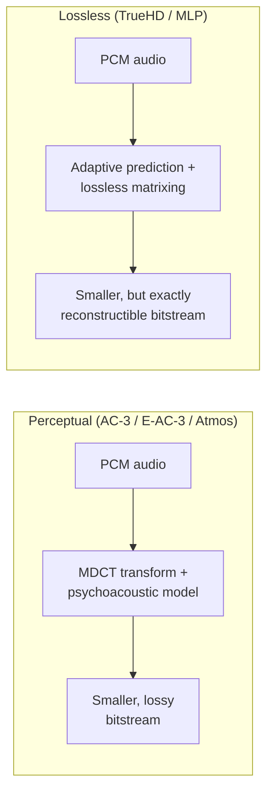
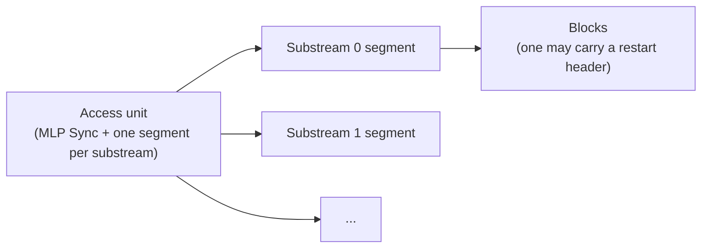
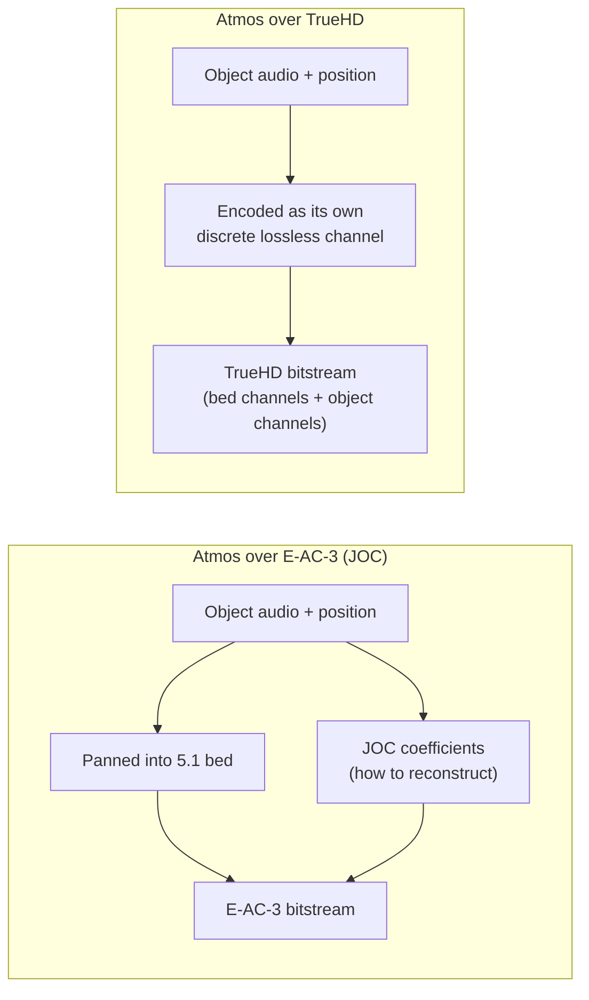

# TrueHD & MLP

[Concepts](index.md) introduced AC-3, E-AC-3 and Atmos-over-E-AC-3 as one lineage, each
building on the last. Dolby TrueHD is not a fourth link in that chain — it's a second,
unrelated lineage that happens to also carry Dolby Atmos. This page explains what makes it
different, how Atmos rides inside it (which is *not* how Atmos rides inside E-AC-3), and what
this project currently knows versus still has to work out before it can be built.

!!! note "Status: a complete internal lossless codec (v1 single-channel shape) is landed"
    `ac3::mlp` (`src/forge/include/ac3/mlp/`, `src/forge/src/mlp/`) now runs end to end:
    `StreamEncoder`/`StreamDecoder` (`stream.hpp`) assemble spec-exact access units - `mlp_sync`
    with `check_nibble`, periodic `major_sync_info()` with restart headers on exactly the
    major-sync units, the substream directory, `substream_segment()` with §4.6.6/§4.6.7
    parity+CRC and 16-bit padding - around a working block codec (`block.hpp`): B1 constant-LSB
    stripping, the lossless quantizer-in-loop predictor (`predictor.hpp`, WO Figs. 6/10/11
    architecture, WO Table 1 presets), and the real entropy layer (`huffman.hpp`, transcribed
    from WO 96/37048 Tables 2-7, replacing the earlier Rice stand-in). Multi-access-unit streams
    round-trip bit-exactly at all six sample rates, integer arithmetic throughout.

    Multichannel is in: blocks carry up to 16 channels through the WO Fig. 3/26a order -
    per-channel B1 strip, then the PMQ matrix cascade (`matrix.hpp`, coefficients in the block
    header, n-1 per stage), then per-channel predictors and entropy coding with a per-sample
    interleaved payload - and the stream layer scopes the channel count in-band via the restart
    header's `max_chan`/`ch_assign`, the way real MLP does. Verified property: correlated
    channels code measurably smaller with the decorrelating matrix than without.

    The encoder now chooses for itself: `StreamConfig::automatic` (`select.hpp`) searches a
    predictor palette (the difference family plus the WO Table 1 presets) per channel and
    greedily builds a decorrelating matrix cascade from pairwise least-squares fits, keeping
    each step only if the *measured* coded size shrinks - the WO's own suggested encoder
    practice of trying preselected filters per block and keeping whichever wins. And the codec
    is drivable end to end from the command line: `ac3cli truehd-encode <in.wav> <out.mlp>` /
    `ac3cli truehd-decode <in.mlp> <out.wav>`, working in integer PCM16/PCM24 sample words
    throughout (`ac3::io::read_wav_pcm`/`write_wav_pcm` - the float-normalized WAV path would
    forfeit bit-exactness), writing §5's raw access-unit `.mlp` file shape, framing on the
    length field to read it back, and learning sample rate, channel count, *and* wordlength
    in-band on decode.

    The encoder's spec obligations beyond framing are met too. **FIFO timing** (§2.6-2.7): the
    encoder schedules each access unit's `input_timing` so the effective delivery rate
    `size[n] / (input_timing[n+1] − input_timing[n])` never exceeds the 18 Mbit/s FBA ceiling,
    with the FIFO delay capped at 12 frames - which provably bounds decoder-buffer occupancy at
    106,470 bytes, inside §2.7's 120,000-byte minimum - and glides back to a constant delay on
    compressible audio; audio that genuinely exceeds the channel is counted
    (`rate_violations()`), not silently mistimed. **`peak_data_rate`** (§4.2.6, 1/16 bit per
    sample period over the whole stream) is measured by the encoder and written exactly via the
    CLI's two-pass encode (the field is fixed-width, so pass two's access units are
    byte-identical apart from it). **End-of-stream terminators** (§4.6.2-4.6.5, `0x348D3` +
    `zero_samples`/`0x1234`) mark the final access unit; the `zero_samples` count carries how
    much silence the encoder appended to fill it, so decode returns the source's *exact* sample
    count - round trips are now length-exact, not just content-exact. **DC offsets** (WO: the
    LSB word's leading bits) are exploited: each channel's significant words are centred on
    their midrange before prediction, for free (the slot is always present), which keeps a DC
    pedestal - or a predictor's warm-up view of one - from widening the whole block's entropy
    table.

    **Noise shaping is deliberately absent, not missing**: in WO 96/37048 the noise shaper acts
    on the quantizer inside the prediction loop, and that quantizer only quantizes in the lossy
    operating mode. This encoder is lossless-only, the in-loop quantizer is the identity, and
    the shaper state would be identically zero - dead machinery. It becomes relevant only if a
    lossy/rate-capped mode is ever added.

    The Atmos structural layer is in. `major_sync_info()` now carries the full
    `channel_meaning()` extension - `16ch_channel_meaning()` (§4.4) transcribed field by field
    (dialogue norm/mix level, `dyn_object_only`, the Table 17 content-description bitmask,
    Table 18 loudspeaker assignment, Table 19 ISF formats, dynamic-object count, with §4.4.10's
    channel-sum consistency enforced both ways), gated on `substream_info` bit 7 exactly as
    §3.3.4 couples them. `EXTRA_DATA()` (§4.8, `extra_data.hpp`) frames opaque per-access-unit
    payloads with its length-check nibble and 0xA9 parity - and the stream layer carries both:
    `StreamConfig::sixteen_channel` describes the channel roles in-band, and
    `encode_access_unit`'s `extra_data` parameter rides an EMDF container (`ac3::emdf`, the
    same TS 102 366 Annex H code the E-AC-3 Atmos path uses) holding per-frame OAMD object
    positions (`ac3::oba::build_payload`). Verified end to end: a 12-channel stream - a 5.1
    bed as loudspeaker feeds plus six dynamic objects as discrete lossless channels, TrueHD's
    way - round-trips bit-exactly with its channel roles and per-frame object metadata intact.
    `ac3::mlp::AtmosEncoder` (`atmos.hpp`) is the assembled convenience: state the bed once as
    a Table 18 mask (the OAMD bed mask is derived - the two tables name identical channel sets
    with reversed bit order), hand it bed+object channels and per-frame `oba::DynamicObject`
    positions, and it manages the presentation description, the OAMD/EMDF wrapping, and the
    metadata cadence (`metadata_interval`, default one emission per major sync). The CLI's
    `truehd-atmos <in.wav> <out.mlp> [objects] [paths.txt]` drives it end to end, with motion
    from the same keyframe-file format atmos-path/atmos-encode use. The GUI has it too: the
    header's "TrueHD…" dialog (`TruehdDialog.qml` / `TruehdController`, a parallel sibling to
    EncoderController rather than a third codecIndex - TrueHD has no bitrate to choose and runs
    integer-exact where that pipeline is float) encodes a PCM16/24 WAV in either mode and
    reports only after decoding the written stream back and verifying it bit-exact.

    V1 shape limits, deliberately: one substream, one block per access unit. The block
    header's field order is a documented self-consistent packing of the WO's inventory, NOT the
    shipping layout - interop with real TrueHD decoders still requires the layer-3/4 format
    sources. The one remaining Atmos-metadata question is narrower than ever: whether shipping
    TrueHD wraps its object metadata in EXTRA_DATA() exactly as EMDF, or in a further
    proprietary wrapper (see [What's confirmed versus what's still
    open](#whats-confirmed-versus-whats-still-open)).

## A different lineage: lossless, not perceptual

AC-3 and E-AC-3 are **perceptual** codecs: they throw away detail a listener is unlikely to
notice, using a transform (MDCT) and a psychoacoustic bit-allocation model, the same broad
family of technique as MP3 or AAC. Dolby TrueHD is built on **MLP** (Meridian Lossless
Packing), a completely different approach: **lossless** compression, using adaptive prediction
filters and lossless matrixing so that a decoder reconstructs the *exact* original PCM samples,
bit for bit. Nothing about it derives from or extends AC-3's transform-coding design.

One practical consequence: because reconstruction must be *exact*, TrueHD has no tolerance for
the small floating-point differences this project's AC-3/E-AC-3 path already accepts (see
[Validation](../verification.md)). Every step of the core algorithm has to be integer/fixed-point
arithmetic, reproducible identically across compilers and architectures.

## Bitstream organization

TrueHD has two levels of structure. Externally, the stream is a sequence of **access units**,
each beginning with an **MLP Sync** — either a lightweight *minor sync* (just enough to time and
size the access unit) or, roughly once every 128 access units, an expanded *major sync*
carrying everything a decoder needs to start from scratch. Internally, each access unit carries
one segment per **substream**, and each substream is a sequence of **blocks**, some of which
begin with a **restart header** — the actual point decoding can (re)start from.

An audio frame is 40 multichannel samples at 48 kHz (scaling with rate: 80 at 96 kHz, 160 at
192 kHz) — far shorter than E-AC-3's 1536-sample frame. Delivery is smoothed through a shared
encoder/decoder FIFO (minimum 120,000 bytes) so a lossless stream's inherently variable data
rate stays within an 18.0 Mbps peak, using `input_timing`/`output_timing` fields the encoder is
responsible for computing correctly — this is a real encoder obligation, not just bitstream
framing.

## Presentations: 2, 6, 8, and up to 32 channels

A single TrueHD bitstream can carry several **presentations** at once — alternative renderings
of the same programme for decoders of different capability. `channel_meaning()` describes a
2-channel, 6-channel and 8-channel presentation inline (dialogue normalization, mix level,
channel assignment for each); `substream_info` says which substream(s) each one needs. A
low-capability decoder plays the narrowest presentation it understands and ignores the rest —
the same "ignore what you don't recognise" backward-compatibility principle E-AC-3 uses for
Atmos, just applied to whole alternative channel counts instead of a side-channel.

Beyond 8 channels, an optional `16ch_channel_meaning()` structure (despite its name) describes
up to 32 channels — its channel-count field is 5 bits, one less than the count, so `11111` means
32. This is where TrueHD's channel space actually reaches the "up to 32 channels" and 14.2.8
layouts Dolby has published, well beyond anything `ac3::plan::LayoutId` currently models.

## Atmos in TrueHD: discrete channels, not JOC

This is the important structural difference from [Atmos & JOC](atmos-joc.md). Atmos-over-E-AC-3
exists because E-AC-3 only has room for a 5.1 bed plus a side channel of matrix coefficients —
JOC parametrically reconstructs objects from that bed, and two objects that panned identically
into the bed can't be perfectly separated back out. TrueHD has no such constraint: it's
lossless, with headroom for up to 32 channels, so **objects just ride as their own discrete
channels** — no downmix, no parametric reconstruction, no shared-direction ambiguity.

`16ch_channel_meaning()` says exactly what's in those channels: ordinary loudspeaker feeds,
channels of a fixed "Intermediate Spatial Format" production/exchange bed (three defined
layouts, 10/14/15 channels), and/or a count of trailing dynamic-object channels — in that order,
mixed and matched via a content-description bitmask.

## What's confirmed versus what's still open

Two Dolby documents (see [References](#references)) together fully specify the bitstream's
**framing and metadata**: every field of `access_unit()`, `major_sync_info()`,
`channel_meaning()`/`16ch_channel_meaning()`, `substream_directory`, `substream_segment()`,
`block()`, `restart_header()` and `EXTRA_DATA()`; all three CRC/parity schemes; the FIFO timing
model; and — critically — the static/structural side of how Atmos objects are described
(channel counts, assignment, ISF bed choice). None of that is guesswork.

What neither document specifies:

- **The core compression algorithm.** `block_data()`'s actual matrixing coefficients,
  prediction-filter computation and entropy/Huffman coding of residuals are explicitly out of
  scope of both Dolby documents ("does not address details of the core audio encoding and
  decoding algorithm").
- **Per-frame dynamic object metadata.** The channel-layout side of Atmos-in-TrueHD is fully
  documented (above), but *where an object actually is, moment to moment* isn't — that almost
  certainly rides in the one described extension point, `EXTRA_DATA()`, but its internal payload
  format for object positions is proprietary and undocumented in either source.

## How the missing pieces will be sourced

[CONTRIBUTING.md's clean-room rule](https://github.com/iainchesworth/ac3forge/blob/main/CONTRIBUTING.md#the-clean-room-rule)
— "the constraint the whole project rests on" — requires every table and algorithm to be
transcribed from a published standard, with open-source encoders like FFmpeg usable only for
architecture lessons, never as something to transcribe from, "because the spec contains every
table." That premise holds for AC-3/E-AC-3, where A/52 is a complete public spec. It does not
hold for MLP's core algorithm: unlike JOC (which has one narrow exception — TS 103 420 ships its
Huffman tables as a literal C file that counts as the standard itself), **no public standard for
MLP's core algorithm exists at all**.

Given that gap, the two missing pieces above will be independently derived from academic papers
and expired/public patent literature on Meridian Lossless Packing — cited in code comments the
same way A/52 section numbers are cited elsewhere in this codebase — rather than by reading
FFmpeg's `mlpenc.c`/`mlpdec.c` source. FFmpeg remains usable exactly as it already is for
AC-3/E-AC-3: as a black-box decode oracle to check output against, never as a source to read.

### Candidate sources for the core algorithm

Two independent primary families exist: academic papers by MLP's original inventors, and the
foundational (now-expired) patent family. Three of the papers and both key patents have now
been read in full (the user supplied PDFs for the papers directly); one further paper is a
newly-identified candidate, found only via the ones already read.

**Academic papers (primary):**

- **Read.** Gerzon, M. A.; Craven, P. G.; Stuart, J. R.; Law, M. J.; Wilson, R. J. — *"The MLP
  Lossless Compression System for PCM Audio"*, AES 17th International Conference on
  High-Quality Audio Coding, Florence, 1999 September; revised 2003 December, published in
  *J. Audio Eng. Soc.*, Vol. 52, No. 3, 2004 March, pp. 243–260. The fullest of the three papers
  read this session — see [What the AES papers
  add](#what-the-aes-papers-add-to-the-patent-account) below.
- **Read.** Stuart, J. R.; Craven, P. G.; Gerzon, M. A.; Law, M. J.; Wilson, R. J. — *"MLP
  Lossless Compression"*, AES 9th Regional Convention, Tokyo. Explicitly "an abbreviated version
  of [the JAES paper above]" — same content, same figures, no material technical detail beyond
  it. Worth keeping as a source only because it independently confirms decoder complexity
  figures (≈27 MIPS for 2-channel @192 kHz, ≈40 MIPS for 6-channel @96 kHz) the JAES paper
  doesn't state.
- Craven, P. G.; Law, M. J.; Stuart, J. R. — *"Lossless Compression Using IIR Prediction
  Filters"*, AES 102nd Convention, Munich, March 1997 (Preprint 4415). **Dropped from the active
  reading list** — its own citation trail shows it isn't the source of the actual predictor
  architecture: the JAES paper's §4.4 attributes Figs. 10/11 (the real algorithm) to the patent
  (their ref [8]), and cites this preprint (their ref [9]) only for motivating *why* IIR matters
  at high sample rates, content the JAES paper already restates. No accessible copy was found
  this session either, so it isn't worth chasing further unless a specific gap shows up later
  that the patent + JAES paper's Figs. 8–11 don't cover.
- **Read.** Craven, P. G.; Gerzon, M. A. — *"Lossless Coding for Audio Discs"*, *J. Audio Eng.
  Soc.*, Vol. 44, No. 9, pp. 706–720, 1996 September. The deepest and earliest of the three
  papers read this session — see [What this paper adds](#what-lossless-coding-for-audio-discs-adds)
  below. It significantly sharpens (and partly corrects) the entropy-coding picture the later
  papers left ambiguous.

**Patents (primary, algorithmic detail, foundational IP) — read:**

- **US 6,891,482 B2** — *"Lossless coding method for waveform data"* (Craven & Gerzon;
  originally Meridian Lossless Packing Limited, later Dolby Laboratories Licensing Corp.;
  priority 1995; expired). The core MLP patent. Describes FIR prediction filters with rational
  coefficients, a rounding quantizer with optional noise shaping inside the prediction loop,
  n×n matrix quantizers for multichannel decorrelation, and a final Huffman entropy-coding
  stage — a real algorithmic skeleton, not just claims boilerplate.
- **US 7,193,538 B2** — *"Matrix improvements to lossless encoding and decoding"* (Gerzon &
  Craven, same assignee lineage). Follow-on patent specifically about the matrixing stage.
- Same-invention family, for reference if more filing-history detail is needed:
  **WO1996037048A2** (the international application both papers' reference lists cite directly
  as PCT/GB96/01164, filed 1996 May), **US20040125003A1**, **CA2585240C**.

**Tertiary (orientation only — not citable as an algorithm source per the clean-room rule):**
Wikipedia's Meridian Lossless Packing page, the Hydrogenaudio wiki entry, and Robert C. Maher's
"Lossless Compression of Audio Data" textbook chapter. None describe the algorithm in
implementable detail; useful only for vocabulary and pointing at further primary citations.

### What the two patents actually describe

Read via Google Patents' rendering of each (not yet cross-checked against the primary USPTO
PDF — see the caveat below).

!!! warning "Caveat before this drives any code"
    The quotes below are an AI-summarized read of Google Patents' web rendering, not a direct
    read of the primary USPTO document. Good enough to plan against; not good enough to cite
    verbatim in a code comment without first checking the fragment against the actual patent
    PDF (`image-ppubs.uspto.gov/dirsearch-public/print/downloadPdf/6891482` and `/7193538`) —
    the same discipline `core/crc16.hpp` and friends already apply to A/52 section numbers.

**Prediction (US 6,891,482 B2).** The encoding filter is
`1 / [1 + B(z⁻¹)] × [1 + A(z⁻¹)]`, where A and B are FIR filters with rational coefficients
(shared denominator, e.g. all coefficients of the form m/16 or m/64). A worked third-order
example bounds each coefficient to a range like `-192 ≤ 64a₁ ≤ 192`. The loop structure: a
summing node feeds an integer rounding quantizer with unity step size (so its output is always
integer-valued and exactly representable), and that output feeds back through filter B to the
same summing node. Per-block state variables are the first *n* input and output samples (for an
*n*th-order filter), transmitted so a restart point can initialize the loop exactly.

**Entropy coding (US 6,891,482 B2).** Not a single fixed Huffman table: 17 tables, selected
per block by the block's peak signal level (signal-adaptive, Laplacian-PDF-shaped). Only the 4
most-significant *varying* bits of the residual are Huffman-coded; the remaining
less-significant bits are sent unaltered/uncoded after the Huffman word. Quoted overhead versus
an optimal entropy coder: "typically less than optimal by only about 0.1 to 0.3 bit/sample."

**Matrixing (US 7,193,538 B2).** Multichannel decorrelation is a cascade of **Primitive Matrix
Quantisers (PMQs)**, each modifying one channel by adding proportions of the others while
staying exactly invertible — restricted to matrices with determinant 1, which is why encoded
coefficients get scaled (e.g. by 4/3) and the decoder applies the compensating inverse scale.
This directly explains several `restart_header()` fields the bitstream-description PDF names
but doesn't define the *purpose* of:

  - `dither_seed` (u(23)) — PMQ quantization needs synchronized dither between encoder and
    decoder to stay lossless; the patent calls this "diamond dither" (sum of two independent
    rectangular-PDF sequences → triangular PDF), seeded and regenerated identically on both
    sides from this field.
  - `max_shift` (s(4)) — the patent's `output_shift`: downmix coefficients can push the result
    past 24-bit range, so the encoder pre-scales by a power of two and the decoder applies the
    compensating shift before clipping, rather than constraining coefficients to unacceptably
    low levels.
  - `max_lsbs` (u(5)) — the patent's LSB-bypass path: a PMQ with a sub-unity gain coefficient
    (e.g. ±½) produces one extra bit of precision the main path can't carry; that bit rides
    separately and gets shifted back in in the decoder.
  - `lossless_check` (u(8)) — an 8-bit parity word the encoder computes over the *actual*
    (multichannel) or *simulated* (downmix) output before transmission, so a decoder can detect
    an algorithmic mismatch rather than silently losing losslessness; each channel's word is
    bit-rotated by its channel number so an identical error across channels is still caught.
  - `ch_assign[]` (u(6) per channel) — recovers channel order after the encoder permutes
    channels via partial pivoting (favouring the first two channels for the 2-channel downmix
    substream).

None of this is final — it needs a direct read of the patent PDFs themselves (not just an AI
summary of them) before it's solid enough to write `block_data()` against. But it's enough to
know the shape of the remaining work, and it already explains several `restart_header()` fields
(see [restart_header.hpp](https://github.com/iainchesworth/ac3forge/blob/main/src/lib/include/ac3/mlp/restart_header.hpp),
which packs them at their documented positions with this same provisional-semantics caveat).

### What the AES papers add to the patent account

The JAES 2004 paper (Gerzon, Craven, Stuart, Law, Wilson) is the fullest of the three read this
session — the Tokyo paper is an earlier, strictly shorter version of the same material. Both
independently corroborate the patents' account rather than contradicting it, and add systems-level
framing the patents (written for claims, not exposition) don't bother with:

- **The matrix stage is confirmed from a second angle.** Fig. 4 shows the same structure as the
  patent's PMQ cascade, just in the paper's own notation: each "affine transformation" modifies
  one channel by adding a quantized linear combination of the others (`m_coeff[1,2]`,
  `m_coeff[1,3]`, `m_coeff[1,4]` feeding a summing node and quantizer `Q`), with the encoder and
  decoder sides being exact mirrors of each other. "A trivial (though important) example" is a
  stereo mix rotating from L/R to sum/difference.
- **Prediction is IIR-capable up to 8th order**, confirmed explicitly ("The encoder is free to
  select IIR or FIR filters up to eighth order from a wide palette") — the patent's worked
  example was only 3rd-order, so this sets the real upper bound. Figs. 8–11 give the same
  encoder/decoder block structure as the patent's `1/[1+B(z⁻¹)] × [1+A(z⁻¹)]`, framed as: a
  conventional FIR/IIR predictor doesn't survive lossless round-tripping because IIR filters
  with fractional coefficients "cannot be exactly implemented since representation of the
  recirculating signal requires an ever-increasing word length" — the fix is quantizing *inside*
  the feedback loop (their Fig. 10/11) so only finite-precision values ever recirculate.
- **Entropy coding is framed around Rice coding, not "17 Huffman tables" as such** — though the
  two aren't necessarily in tension: "audio signals often have a Laplacian distribution... The
  Rice code provides a simple and near-optimal way of encoding such a signal... and has the
  advantage that encoding and decoding need not use tables," but "the Rice code is not used
  unconditionally, the MLP encoder may choose from a number of entropy coding methods,"
  including plain PCM as a fallback for pathological "peak-level RPDF (all values equally
  probable) white noise" the encoder shouldn't try to compress. A parameterized Rice code and a
  small family of matched Huffman tables are two ways of describing the same near-Laplacian-optimal
  coding — the patent's account may just be describing a concrete table-driven implementation of
  what these papers describe more abstractly. Worth resolving explicitly once `block_data()`
  implementation starts, not assumed equivalent without checking.
- **`lsb_bypass` is a real, named signal path in both papers' own block diagrams** (Fig. 3/21 of
  the JAES paper, Fig. 3/16 of the Tokyo paper) — independent confirmation of the patent's
  LSB-bypass account for `max_lsbs`, beyond the patent alone.
- **"Decoder lossless self-check" is listed as one of MLP's defining novel techniques** in both
  papers' §3, without bit-level detail — corroborates `lossless_check`'s purpose (the patent's
  account of *how* is still the only source for the actual mechanism).
- **Channel ceiling reconciled.** Both AES papers state MLP supports "up to 63 audio channels" —
  not 32. This isn't a conflict with the TrueHD-specific bitstream-description document's
  32-channel figure (from `16ch_channel_count`'s 5-bit, "one less than count" field): 63 is the
  general MLP architecture's ceiling (`ch_assign[]` is `u(6)`, i.e. 0–63), while 32 is the
  ceiling the *TrueHD/Blu-ray FBA profile specifically* exposes through its own narrower
  presentation-count field. The general format goes wider than what this project's target
  profile can address.
- **Concrete validation targets for Phase 4**, once there's a real encoder to check: Table 1's
  peak/average data-rate reduction figures (4 bit/sample peak @48 kHz, 8 @96 kHz, 9 @192 kHz)
  and the Tokyo paper's decoder complexity figures (≈27 MIPS for 2-channel @192 kHz, ≈40 MIPS
  for 6-channel @96 kHz) are real published numbers a working implementation should land near.

### What "Lossless Coding for Audio Discs" adds

This 1996 paper is earlier and more foundational than the other two — it develops the ideas from
first principles rather than describing a finished system, and in doing so gives real mechanism
detail the later, more polished papers only gesture at.

- **Entropy coding is genuine table-driven Huffman coding, not Rice/Golomb coding** — this is a
  real correction to the working hypothesis in [What the AES papers
  add](#what-the-aes-papers-add-to-the-patent-account) above. The paper walks through a full
  worked example: a synthetic distribution split into a "near" range and a "far" range, one bit
  spent to say which range a value falls in, then a fixed-width field for the value within that
  range — and a second worked example with an explicit input-value-to-codeword table for a
  seven-level distribution, netting real bits-per-sample figures against plain PCM. Critically,
  it also confirms the adaptive-table mechanism the patent's "17 tables" almost certainly refers
  to: the encoder keeps "a selection of decoding tables available" and picks whichever suits the
  current block's sample-value distribution, block by block. `ac3::mlp::rice` (Golomb-Rice) is
  therefore best understood as a well-defined, testable *stand-in* for this stage — a reasonable
  near-optimal choice for a Laplacian source, and not a wasted primitive — but not a confirmed
  match for MLP's actual mechanism, which is table-selected Huffman. Implementing a real
  MLP-shaped entropy coder needs an actual Huffman table (or table family), not just a Rice
  parameter.
- **Predictor state transmission and block-length tradeoffs are explained, not just asserted.**
  At the start of each block a restart needs the filter's own delay-memory state — "these
  internal filter data... are termed 'initialization data'" — and a higher filter order directly
  means more of this per-block overhead, which is the actual reason real designs stay around
  3rd–4th order rather than going higher (the earlier sources stated the practical order limit;
  this paper explains why it exists as a real cost/benefit tradeoff, not a rule of thumb).
- **Error containment motivates the restart-point architecture directly.** IIR predictor errors
  recirculate indefinitely once introduced, and Huffman coding's variable-length codewords let a
  single bit error desynchronize the decoder from the encoder — both problems are bounded by
  packing "full initialisation and restart information" into every block, i.e. exactly the
  `restart_header()` mechanism already implemented in `ac3::mlp`, now with a first-principles
  rationale rather than just a bit-layout table to transcribe.
- **Determinism was a first-order design constraint from the start**, not an incidental
  refinement: cross-platform bit-exact output "must give bit-exact identical outputs" between
  independently implemented encoder/decoder predictor pairs is called out explicitly, predating
  the patent's more mechanical fixed-point/rational-coefficient solution to the same problem.
- One divergence from the eventual TrueHD/Blu-ray profile, not a contradiction: this paper's own
  provisional 1996 proposal used block lengths as low as 384 samples, wider than the
  confirmed 40–160-sample blocks in the actual FBA syntax (`mlp_tables.hpp`'s
  `samples_per_access_unit`) — later tuning during MLP's evolution into TrueHD, not a conflict
  to resolve.

### The wire-format source hunt

A six-angle verified sweep (patent family, standards bodies, academic literature, community
documentation, Dolby's own channels, and the archive sites that yielded the earlier papers)
settled where `block_data()`'s syntax can and cannot come from.

**Nothing public contains the shipping FBA syntax.** Confirmed exhaustively: no AES paper (a
41-result "Meridian Lossless Packing" sweep plus a 12-result "TrueHD" sweep), no standards body
(no SDO has ever published the codec itself), no community documentation (MultimediaWiki's MLP
page stops at exactly the framing layer this project already implements), and Dolby's retired
developer portal — per a Wayback CDX enumeration of its whole TrueHD assets folder — never
hosted more than the two PDFs already in `docs/reference/`.

**Free, and now in hand:**

- **WO 96/37048 A2** (Craven & Gerzon, the PCT parent of the already-read US 6,891,482 B2) —
  uniquely in the family, its as-filed text carries actual entropy-code tables (Table 2's
  Laplacian 4-bit Huffman code; Table 3's 17 Huffman tables selected by per-block peak level;
  Table 7's PCM fallback code) and block-header figures (Figs. 18a/18b: Huffman table number,
  LSB word, bit-precision field, FIR/IIR coefficients a1–a3/b1–b3, filter initialization
  state). This is 1995 *proto*-MLP, not the shipping syntax — but it is the only bit-level
  entropy/header material anywhere public, and the natural skeleton to build the remaining DSP
  primitives against. Cited by number, not archived (the PDF is a 166-page scanned facsimile;
  the tables are legible in Google Patents' page text).
- **Malcolm Law's Dolby-era TrueHD patents** — US 9,826,327, US 9,794,712, US 10,068,577:
  Atmos-substream semantics straight from Dolby (seed-plus-delta interpolated primitive
  matrices; legacy coefficient range [-2, 2) versus a maximum of 128 in the adaptive-audio
  syntax; 24- versus 32-bit datapaths; the four-substream hierarchy; channel assignment once
  per restart interval).
- **WO 2016/018787 A1** — the Atmos-in-TrueHD framing model: object metadata packaged as
  Evolution (EMDF) frames carrying OAMD, framed into 40-sample access units, with the exact
  sample-offset arithmetic and per-rate scale factors. Combined with ETSI TS 102 366 Annex H
  (EMDF — **already implemented in this repo as `ac3::emdf`**) and ETSI TS 103 420 (bit-level
  OAMD payload syntax — already exercised by the JOC work), Phase 3's metadata path is now
  substantially publicly specified: the open question shrinks from "how does Atmos ride in
  `EXTRA_DATA()` at all" to the TrueHD-specific wrapper details around an EMDF+OAMD payload
  this codebase can already build.
- **Five documents added to `docs/reference/`**: the AES 17th Conference (1999) version of the
  MLP system paper; Meridian's 62-page **MLP Encoder User Guide** (the only public document
  describing the real encoder's behaviour: channel-assignment rules, the lossless 6→2 downmix,
  data-rate control, the proofing decoder); the Tokyo "Lossless Compression for DVD-Audio"
  companion paper; and both ARA proposals every MLP paper cites.

**Purchasable, recommended** (AES E-Library, $33 each for non-members, free with membership):

- Craven, Law, Stuart, Wilson — *"Hierarchical Lossless Transmission of Surround Sound Using
  MLP"*, AES 24th International Conference (Banff, June 2003), e-lib id 12297. The one
  designer-authored MLP paper still unread; substream/matrix-hierarchy semantics.
- Craven, Law, Stuart — *"Lossless Compression Using IIR Prediction Filters"*, preprint 4415,
  e-lib id 7364. **Reinstated** after being dropped earlier on citation-trail reasoning: the
  sweep confirms it is the closest published source for predictor coefficient quantization and
  state handling — exactly the fields `block_data()` has to encode.

**The core reference, obtainable with real-world effort:** the DVD Forum's *"Packed PCM: MLP
Reference Information"* — a 69-page annex to *DVD Specifications for Read-Only Disc, Part 4* —
is the document DVD-Audio implementers actually worked from, and the only named,
non-licensee-channel document credibly containing block-header/block-data layout, coefficient
encoding, and the entropy tables. DVD FLLC dissolved on 31 January 2025 and deposited its
format books at Japan's **National Diet Library** (Tokyo Main Library, call number M361-D120);
it can be read in person or partially copied via NDL's overseas remote photoduplication service
(per-page fees plus shipping — tens of dollars, not thousands; Japanese copyright practice
limits each request to roughly half the work, so a full copy takes two staged requests).
Caveats: it specifies the DVD-Audio variant (FBB sync `0xF8726FBB`) — the core block machinery
is shared but TrueHD's FBA deltas are not covered — and the pages may carry legacy
confidentiality markings, so a quick legal sanity-check is prudent before quoting verbatim
in-repo.

**Ruled out:** the HD DVD-era *"MLP Reference Information v1.0"* (August 2005) — the exact
TrueHD-generation reference, named by IANA's `audio/vnd.dolby.mlp` registration — has no
surviving official channel (FLLC dissolved; not in the NDL deposit). Dolby's *"Dolby TrueHD
Consumer Decoder (with MAT)"* licensee deliverable is the authoritative living source, but its
NDA and bundled reference source code sit badly with an open clean-room project. DeepWiki's
FFmpeg-derived pages are machine paraphrases of `mlpdec.c`/`mlpenc.c` and are excluded as
equivalent to reading that source; MultimediaWiki carries the same provenance flag but contains
nothing beyond the already-implemented framing layer anyway.

### The WO 96/37048 deep read — the public base layer

Triggered by the user spotting that US 7,193,538 B2 cites WO 96/37048 as a description of MLP.
A verbatim-verified read of both documents — with every bit-level table cross-checked against
the scanned patent pages, not just the OCR — confirms the observation and sharpens it into a
working layering model.

**What Dolby's own patent asserts.** US 7,193,538 B2 states, verbatim: *"A description of MLP
may be obtained from DVD Specifications for Read-Only Disc, Part 4: Audio Specifications,
Packed PCM, MLP Reference Information, Version 1.0. March 1999, **and from WO-A 96/37048**."*
And stronger, of the prediction/entropy layer: the lossless encoder and decoder cores, in
preferred embodiments, *"are implemented according to the processes that are disclosed in
WO-A 96/37048."* The patent cites the WO nineteen times, each time attributing a specific
technique to it (primitive matrices/PMQs, reverse-order lossless inversion, the determinant-1
restriction, autodither, eigenvector direction selection, log-spectrum entropy estimation) and
then stating its own divergence (seeded 23-bit Diamond Dither replacing autodither;
non-unity-gain PMQs with `lsb_bypass`; 16-bit coefficients in [-2, +2); six PMQs; `ch_assign`;
the Lossless Check). The honest boundary: the patent never says the WO defines the *shipping
bitstream* — that is the MLP Reference Information's role — and at least one shipping mechanism
(FIFO buffering) is attributed to a third document entirely (US 6,023,233 + the AES 1998 paper).

**What the WO actually contains** (verbatim-extracted; scan-verified where OCR was ambiguous):

- **The complete entropy layer.** Table 2's Laplacian 4-bit Huffman code — all sixteen
  codewords, `-7:00000000` through `0:01`, `1:10`, up to `8:11111111`. Table 3's seventeen-table
  scheme: table *k* (k = 1..17) covers blocks whose significant words fit
  `-2^(k+2)+1 < x <= 2^(k+2)`; the top four *varying* digits are coded with the Table 2 code and
  the remaining k-1 digits follow raw, for k+1..k+7 bits per sample; selection is purely by the
  block's peak absolute significant-word level. Plus small-signal Tables 4–6 (complete
  codewords), the error-robust "PCM" Table 7, and an "empty" table for digital-black blocks that
  suppresses coefficients and initialization entirely. Quoted inefficiency versus optimal
  coding: ~0.2 bit/sample.
- **The full per-block header inventory, with bit budgets.** Huffman table number; B1 (count of
  stripped constant LSBs, "typically requiring 5 bits"); the N-bit LSB word (optionally
  carrying a DC offset in its leading bits); eight filter/noise-shaper coefficients — 50 bits
  total for the six a/b coefficients at m/64 precision (ranges like `-192 <= 64a1 <= 192`,
  packing as 9/9/7/9/9/7), 38 bits at m/16, 4 (or 3) bits for the nine-value integer inner
  noise shaper, 9 bits for the outer shaper; and per-block initialization = 3(N−B1) bits for
  the three input samples plus 12 bits of noise-shaper state.
- **The machinery between header and payload**: the exact PMQ definition (n−1 transmitted
  coefficients per stage, finite precision with a common divisor); fractional-step quantizer
  cascades; the short-header/header-repeat mechanism and state-carry-across-blocks (the direct
  ancestor of restart intervals); block lengths L = 256–1536 (worked example 576; 192/384
  suggested with repeated headers); the GCD step-size generalization of B1; and a
  figure-by-figure inventory of all 53 drawing sheets.
- **What the WO does *not* specify**: byte/word alignment (nothing, anywhere), matrix
  coefficient bit widths, and any channel/substream/packaging syntax — the format layer.

**The revised layering model.** The public record now decomposes shipping MLP as:

1. **WO 96/37048 (1995)** — the algorithms and proto-format: prediction cores, PMQ matrixing,
   noise shaping, the entropy tables, the block-header concept. Public, bit-level, now
   extracted.
2. **US 7,193,538 and siblings (1999)** — the shipping-MLP deltas: substreams and the
   2-channel downmix architecture, seeded Diamond Dither, `lsb_bypass` and gain-bearing PMQs,
   [-2, +2) 16-bit coefficients, `ch_assign`, the Lossless Check, output shift. Public.
3. **MLP Reference Information (DVD Forum Part 4 annex)** — the normative field layout binding
   layers 1–2 into the FBB bitstream. Obtainable via the National Diet Library route above.
4. **TrueHD FBA deltas (2005)** — the `0xBA` syntax generation: 40-sample access units, up to
   four substreams, the 16-channel presentation, `EXTRA_DATA()`/Atmos. Partially public via
   the Dolby 2018 PDF (framing — already implemented), Law's Atmos patents, and
   WO 2016/018787; the residue needs the licensee document or black-box stream analysis.

**Consequences for implementation.** The entropy stage can now be built for real: an
`ac3::mlp::huffman` module transcribed from WO 96/37048's Tables 2–7, citable table-by-table
with the same discipline `core/tables.hpp` applies to A/52 — replacing the Rice stand-in. The
predictor primitive can use the WO's exact coefficient quantization and initialization scheme.
The unknowns now concentrate almost entirely in the format packaging layer (field order and
widths of the *shipping* block header, substream interleave, alignment) — exactly what layer 3
(NDL) and layer 4 (black-box FBA analysis) would resolve.

## v1 scope

Given the size of the gap above, initial implementation targets the fully-specified 2/6/8-channel
presentations (stereo through 7.1) and the core lossless codec — not the `16ch_channel_meaning()`
tier or Atmos, which stay deferred until the per-frame object metadata question is resolved.

!!! example "See it in code"
    - [`src/lib/include/ac3/mlp/`](https://github.com/iainchesworth/ac3forge/tree/main/src/lib/include/ac3/mlp) /
      [`src/lib/src/mlp/`](https://github.com/iainchesworth/ac3forge/tree/main/src/lib/src/mlp) —
      `mlp_sync`/`major_sync_info()` (`sync.hpp`) and `restart_header()` (`restart_header.hpp`),
      the two framing increments built so far
    - [References](#references) below — every source document this page is built from

## References

All saved under [`docs/reference/`](https://github.com/iainchesworth/ac3forge/tree/main/docs/reference)
for citation:

**Bitstream framing and metadata:**

- *Dolby TrueHD (MLP) bitstreams within the ISO base media file format* (Dolby Laboratories,
  2019) — ISOBMFF/MP4 muxing rules, `MLPSampleEntry`/`MLPSpecificBox`, access-unit-to-sample
  mapping. Does not cover the core algorithm.
- *Dolby TrueHD (MLP) high-level bitstream description* (Dolby Laboratories, 7 February 2018) —
  the full external/internal bitstream syntax `sync.hpp`/`restart_header.hpp` are built from.
  Explicitly does not cover the core audio encoding/decoding algorithm.

**Core compression algorithm** — see [Candidate sources for the core
algorithm](#candidate-sources-for-the-core-algorithm), [What the AES papers
add](#what-the-aes-papers-add-to-the-patent-account), and [The wire-format source
hunt](#the-wire-format-source-hunt) above for what each says:

- Gerzon, Craven, Stuart, Law, Wilson, *"The MLP Lossless Compression System for PCM Audio"*,
  *J. Audio Eng. Soc.*, Vol. 52, No. 3, 2004 March — read in full.
- Stuart, Craven, Gerzon, Law, Wilson, *"MLP Lossless Compression"*, AES 9th Regional
  Convention, Tokyo — read in full.
- Craven, Gerzon, *"Lossless Coding for Audio Discs"*, *J. Audio Eng. Soc.*, Vol. 44, No. 9,
  1996 September — read in full.
- Gerzon, Craven, Stuart, Law, Wilson, *"The MLP Lossless Compression System"*, AES 17th
  International Conference (High-Quality Audio Coding), 1999 — conference predecessor of the
  JAES 2004 paper; pending a diff-read.
- Meridian Audio, *MLP Encoder User Guide* (62 pp.) — the real encoder's behavioural
  constraints; pending a full read.
- Stuart, Craven, Law, *"Lossless Compression for DVD-Audio"*, AES 9th Regional Convention,
  Tokyo (companion paper) — DVD-Audio application overview.
- Acoustic Renaissance for Audio, *"A Proposal for the High-Quality Audio Application of
  High-Density CD Carriers"* (v1.3) and *"DVD: Application of Hierarchically Encoded Surround
  Sound"* — the design-requirements documents every MLP paper cites.

Patents (US 6,891,482 B2, US 7,193,538 B2, WO 96/37048 A2, US 9,826,327 B2, US 9,794,712 B2,
US 10,068,577 B2, WO 2016/018787 A1) are fully public via Google Patents/USPTO/FPO and not
duplicated into `docs/reference/` — no download needed, just the patent number.

!!! note "Trademarks"
    "Dolby", "Dolby TrueHD" and "MLP Lossless" are trademarks of Dolby Laboratories. ac3forge is
    not affiliated with, endorsed by, or certified by Dolby Laboratories.

---

Back to [Atmos & JOC](atmos-joc.md), or up to the [Concepts overview](index.md).
