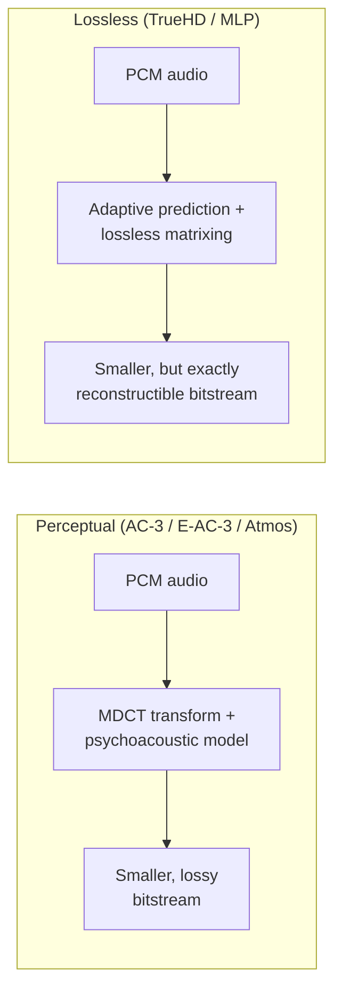
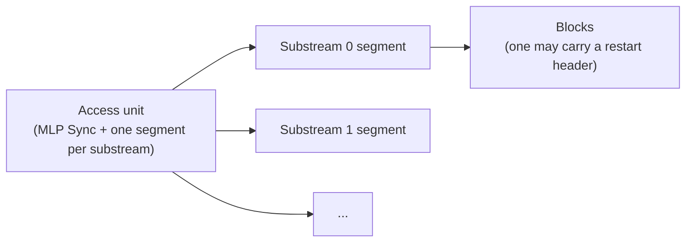
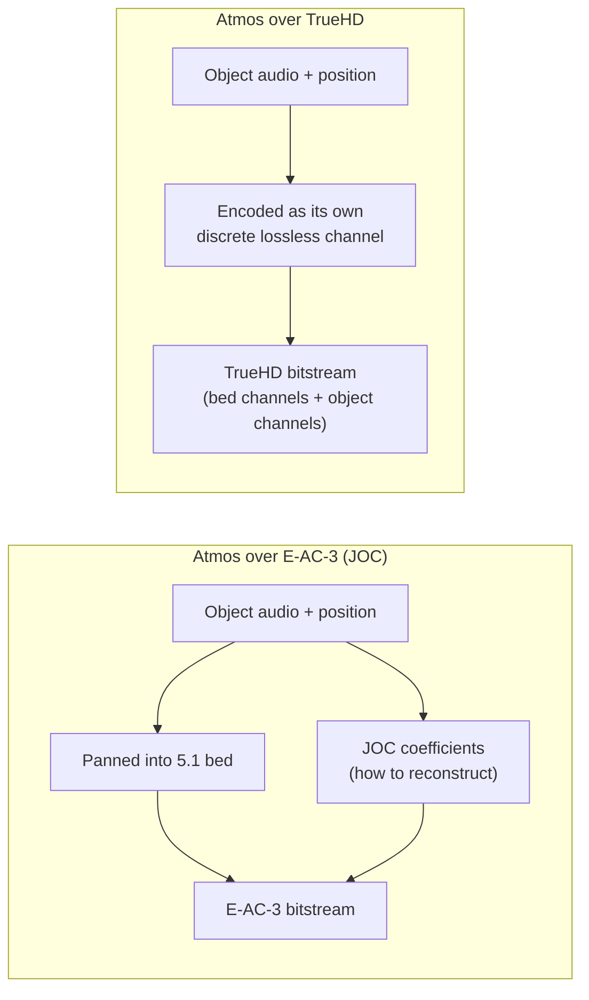

# TrueHD & MLP

[Concepts](index.md) introduced AC-3, E-AC-3 and Atmos-over-E-AC-3 as one lineage, each
building on the last. Dolby TrueHD is not a fourth link in that chain — it's a second,
unrelated lineage that happens to also carry Dolby Atmos. This page explains what makes it
different, how Atmos rides inside it (which is *not* how Atmos rides inside E-AC-3), and what
this project currently knows versus still has to work out before it can be built.

!!! note "Status: mlp_sync/major_sync_info framing landed; the audio-carrying layer has not"
    `ac3::mlp` (`src/lib/include/ac3/mlp/`, `src/lib/src/mlp/`) currently implements
    `mlp_sync`'s `check_nibble` and `major_sync_info()` - format_sync, format_info's channel
    presentations, `channel_meaning()`, and the major-sync CRC - built and round-trip tested
    against the confirmed syntax below. `substream_directory`, `substream_segment()`,
    `block()`, `restart_header()`, `EXTRA_DATA()` and, above all, `block_data()`'s compression
    algorithm are not implemented yet - see [What's confirmed versus what's still
    open](#whats-confirmed-versus-whats-still-open).

## A different lineage: lossless, not perceptual

AC-3 and E-AC-3 are **perceptual** codecs: they throw away detail a listener is unlikely to
notice, using a transform (MDCT) and a psychoacoustic bit-allocation model, the same broad
family of technique as MP3 or AAC. Dolby TrueHD is built on **MLP** (Meridian Lossless
Packing), a completely different approach: **lossless** compression, using adaptive prediction
filters and lossless matrixing so that a decoder reconstructs the *exact* original PCM samples,
bit for bit. Nothing about it derives from or extends AC-3's transform-coding design.

One practical consequence: because reconstruction must be *exact*, TrueHD has no tolerance for
the small floating-point differences this project's AC-3/E-AC-3 path already accepts (see
[Validation](../verification.md)). Every step of the core algorithm has to be integer/fixed-point
arithmetic, reproducible identically across compilers and architectures.

## Bitstream organization

TrueHD has two levels of structure. Externally, the stream is a sequence of **access units**,
each beginning with an **MLP Sync** — either a lightweight *minor sync* (just enough to time and
size the access unit) or, roughly once every 128 access units, an expanded *major sync*
carrying everything a decoder needs to start from scratch. Internally, each access unit carries
one segment per **substream**, and each substream is a sequence of **blocks**, some of which
begin with a **restart header** — the actual point decoding can (re)start from.

An audio frame is 40 multichannel samples at 48 kHz (scaling with rate: 80 at 96 kHz, 160 at
192 kHz) — far shorter than E-AC-3's 1536-sample frame. Delivery is smoothed through a shared
encoder/decoder FIFO (minimum 120,000 bytes) so a lossless stream's inherently variable data
rate stays within an 18.0 Mbps peak, using `input_timing`/`output_timing` fields the encoder is
responsible for computing correctly — this is a real encoder obligation, not just bitstream
framing.

## Presentations: 2, 6, 8, and up to 32 channels

A single TrueHD bitstream can carry several **presentations** at once — alternative renderings
of the same programme for decoders of different capability. `channel_meaning()` describes a
2-channel, 6-channel and 8-channel presentation inline (dialogue normalization, mix level,
channel assignment for each); `substream_info` says which substream(s) each one needs. A
low-capability decoder plays the narrowest presentation it understands and ignores the rest —
the same "ignore what you don't recognise" backward-compatibility principle E-AC-3 uses for
Atmos, just applied to whole alternative channel counts instead of a side-channel.

Beyond 8 channels, an optional `16ch_channel_meaning()` structure (despite its name) describes
up to 32 channels — its channel-count field is 5 bits, one less than the count, so `11111` means
32. This is where TrueHD's channel space actually reaches the "up to 32 channels" and 14.2.8
layouts Dolby has published, well beyond anything `ac3::plan::LayoutId` currently models.

## Atmos in TrueHD: discrete channels, not JOC

This is the important structural difference from [Atmos & JOC](atmos-joc.md). Atmos-over-E-AC-3
exists because E-AC-3 only has room for a 5.1 bed plus a side channel of matrix coefficients —
JOC parametrically reconstructs objects from that bed, and two objects that panned identically
into the bed can't be perfectly separated back out. TrueHD has no such constraint: it's
lossless, with headroom for up to 32 channels, so **objects just ride as their own discrete
channels** — no downmix, no parametric reconstruction, no shared-direction ambiguity.

`16ch_channel_meaning()` says exactly what's in those channels: ordinary loudspeaker feeds,
channels of a fixed "Intermediate Spatial Format" production/exchange bed (three defined
layouts, 10/14/15 channels), and/or a count of trailing dynamic-object channels — in that order,
mixed and matched via a content-description bitmask.

## What's confirmed versus what's still open

Two Dolby documents (see [References](#references)) together fully specify the bitstream's
**framing and metadata**: every field of `access_unit()`, `major_sync_info()`,
`channel_meaning()`/`16ch_channel_meaning()`, `substream_directory`, `substream_segment()`,
`block()`, `restart_header()` and `EXTRA_DATA()`; all three CRC/parity schemes; the FIFO timing
model; and — critically — the static/structural side of how Atmos objects are described
(channel counts, assignment, ISF bed choice). None of that is guesswork.

What neither document specifies:

- **The core compression algorithm.** `block_data()`'s actual matrixing coefficients,
  prediction-filter computation and entropy/Huffman coding of residuals are explicitly out of
  scope of both Dolby documents ("does not address details of the core audio encoding and
  decoding algorithm").
- **Per-frame dynamic object metadata.** The channel-layout side of Atmos-in-TrueHD is fully
  documented (above), but *where an object actually is, moment to moment* isn't — that almost
  certainly rides in the one described extension point, `EXTRA_DATA()`, but its internal payload
  format for object positions is proprietary and undocumented in either source.

## How the missing pieces will be sourced

[CONTRIBUTING.md's clean-room rule](https://github.com/iainchesworth/ac3forge/blob/main/CONTRIBUTING.md#the-clean-room-rule)
— "the constraint the whole project rests on" — requires every table and algorithm to be
transcribed from a published standard, with open-source encoders like FFmpeg usable only for
architecture lessons, never as something to transcribe from, "because the spec contains every
table." That premise holds for AC-3/E-AC-3, where A/52 is a complete public spec. It does not
hold for MLP's core algorithm: unlike JOC (which has one narrow exception — TS 103 420 ships its
Huffman tables as a literal C file that counts as the standard itself), **no public standard for
MLP's core algorithm exists at all**.

Given that gap, the two missing pieces above will be independently derived from academic papers
and expired/public patent literature on Meridian Lossless Packing — cited in code comments the
same way A/52 section numbers are cited elsewhere in this codebase — rather than by reading
FFmpeg's `mlpenc.c`/`mlpdec.c` source. FFmpeg remains usable exactly as it already is for
AC-3/E-AC-3: as a black-box decode oracle to check output against, never as a source to read.

### Candidate sources for the core algorithm

Surveyed but not yet read in full — this is the reading list Phase 1 works from, not a
confirmation that every detail needed is actually in them. Two independent primary families
exist: academic papers by MLP's original inventors, and the foundational (now-expired) patent.

**Academic papers (primary):**

- Gerzon, M. A.; Craven, P. G.; Stuart, J. R.; Law, M. J.; Wilson, R. J. — *"The MLP Lossless
  Compression System for PCM Audio"*, AES 17th International Conference on High-Quality Audio
  Coding, Florence, September 1999 (Paper 17-006). The seminal MLP paper: covers the matrix
  transform, prediction, and MLP's four data-rate-reduction strategies at a systems level.
  Sits in the (likely paywalled) AES E-Library; free mirrors exist (scispace, ResearchGate,
  Semantic Scholar) and should be checked for one that actually downloads cleanly.
- Craven, P. G.; Law, M. J.; Stuart, J. R. — *"Lossless Compression Using IIR Prediction
  Filters"*, AES 102nd Convention, Munich, March 1997 (Preprint 4415). Narrower and more
  directly useful for `block_data()`'s prediction stage: addresses the specific hard problem of
  using IIR filters losslessly despite fractional coefficients and rounding behaviour.
- Stuart, J. R.; Craven, P. G. — *"MLP Lossless Compression"*, AES 9th Regional Convention,
  Tokyo. A freely-hosted copy exists; not yet read in this session (no PDF renderer available at
  research time) — read in full before relying on it.

**Patents (primary, algorithmic detail, foundational IP):**

- **US 6,891,482 B2** — *"Lossless coding method for waveform data"* (Craven & Gerzon;
  originally Meridian Lossless Packing Limited, later Dolby Laboratories Licensing Corp.;
  priority 1995; expired). The core MLP patent. Describes FIR prediction filters with rational
  coefficients, a rounding quantizer with optional noise shaping inside the prediction loop,
  n×n matrix quantizers for multichannel decorrelation, and a final Huffman entropy-coding
  stage — a real algorithmic skeleton, not just claims boilerplate.
- **US 7,193,538 B2** — *"Matrix improvements to lossless encoding and decoding"* (Gerzon &
  Craven, same assignee lineage). Follow-on patent specifically about the matrixing stage.
- Same-invention family, for reference if more filing-history detail is needed:
  **WO1996037048A2**, **US20040125003A1**, **CA2585240C**.

**Tertiary (orientation only — not citable as an algorithm source per the clean-room rule):**
Wikipedia's Meridian Lossless Packing page, the Hydrogenaudio wiki entry, and Robert C. Maher's
"Lossless Compression of Audio Data" textbook chapter. None describe the algorithm in
implementable detail; useful only for vocabulary and pointing at further primary citations.

## v1 scope

Given the size of the gap above, initial implementation targets the fully-specified 2/6/8-channel
presentations (stereo through 7.1) and the core lossless codec — not the `16ch_channel_meaning()`
tier or Atmos, which stay deferred until the per-frame object metadata question is resolved.

!!! example "See it in code"
    - [References](#references) below — the two source documents this page is built from
    - Implementation not yet started; this section will link to the relevant library pages once
      the core codec lands.

## References

**Bitstream framing and metadata** — saved under
[`docs/reference/`](https://github.com/iainchesworth/ac3forge/tree/main/docs/reference) for
citation:

- *Dolby TrueHD (MLP) bitstreams within the ISO base media file format* (Dolby Laboratories,
  2019) — ISOBMFF/MP4 muxing rules, `MLPSampleEntry`/`MLPSpecificBox`, access-unit-to-sample
  mapping. Does not cover the core algorithm.
- *Dolby TrueHD (MLP) high-level bitstream description* (Dolby Laboratories, 7 February 2018) —
  the full external/internal bitstream syntax this page is built from. Explicitly does not cover
  the core audio encoding/decoding algorithm.

**Core compression algorithm** — see [Candidate sources for the core
algorithm](#candidate-sources-for-the-core-algorithm) above; not yet saved to `docs/reference/`
pending a full read-through in Phase 1.

!!! note "Trademarks"
    "Dolby", "Dolby TrueHD" and "MLP Lossless" are trademarks of Dolby Laboratories. ac3forge is
    not affiliated with, endorsed by, or certified by Dolby Laboratories.

---

Back to [Atmos & JOC](atmos-joc.md), or up to the [Concepts overview](index.md).
