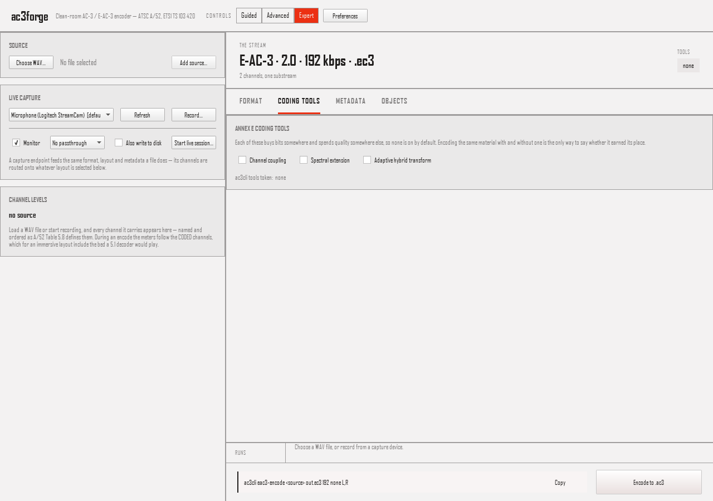
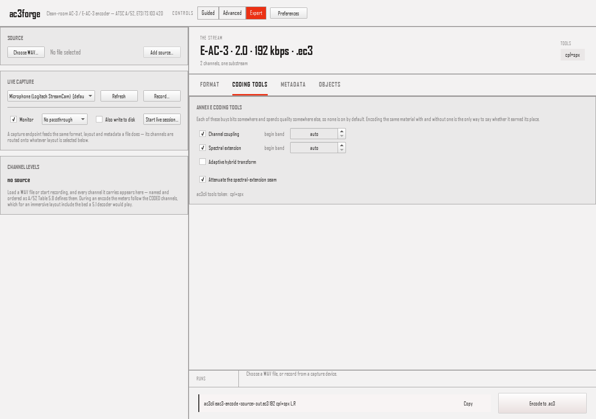

# Coding tools

Expert tier, E-AC-3 only — this tab disappears entirely for AC-3, which doesn't have Annex E.

Three checkboxes, all off by default:

> Each of these buys bits somewhere and spends quality somewhere else, so none is on by default.
> Encoding the same material with and without one is the only way to say whether it earned its
> place.

Checking a tool reveals a spin box next to it that reads **auto** at its lowest value — leave it
there to let the encoder pick a band edge, or pin one explicitly:

| Tool | What its spin box means |
|---|---|
| **Channel coupling** | begin band — auto or pinned (§7.4 / §E3.3) |
| **Spectral extension** | begin band — auto or pinned (§E3.6). Turning it on reveals a further **Attenuate the spectral-extension seam** checkbox. |
| **Adaptive hybrid transform** | GAQ mode, 0–3 — mode 0 is AHT with gain-adaptive quantization switched off, which is how GAQ's own contribution gets measured (§E3.4) |

At the foot of the card, a monospace `ac3cli tools token` readout (`cpl+spx`, `cpl+spx+aht`, …)
shows the exact string that reproduces this configuration on the command line — see
[CLI → Metadata options](../cli/metadata-options.md) for the full `tools:` grammar, including the
`cpl:N`/`spx:N`/`aht:N` pinning syntax this token expands to.

## Next

[Metadata](metadata.md) — loudness, downmix, and heavy compression, the rest of what Expert
adds.
