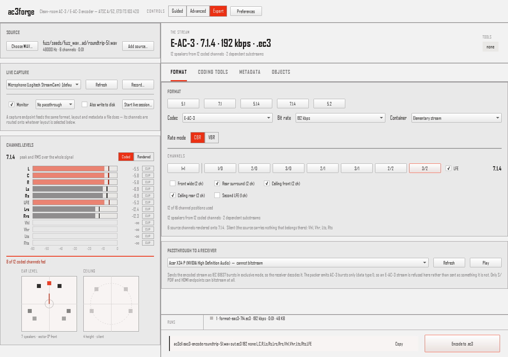
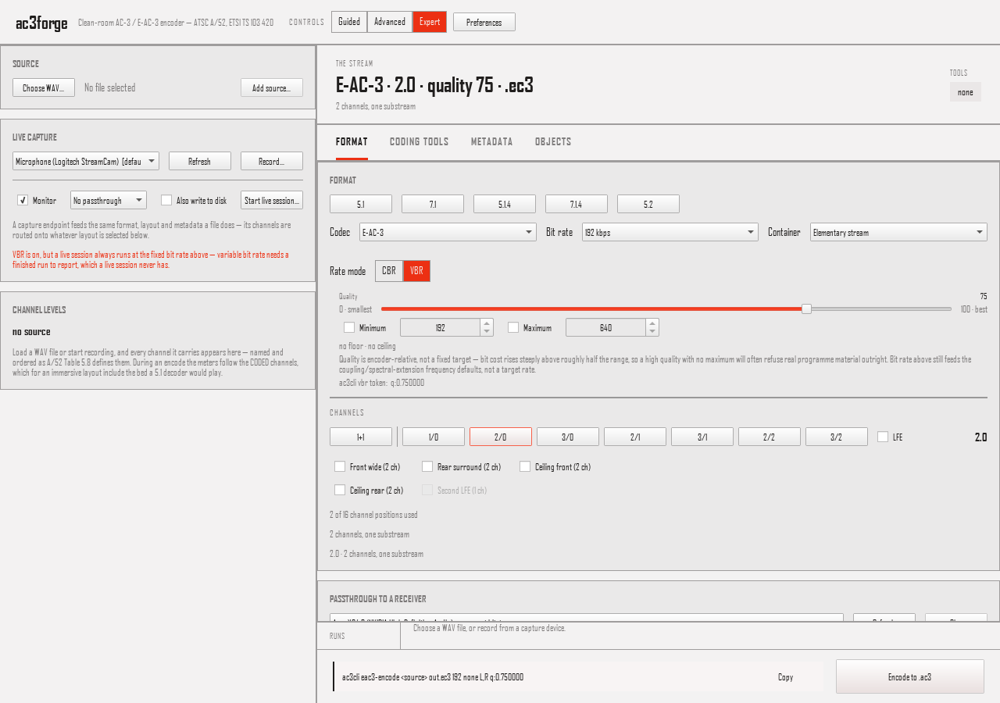
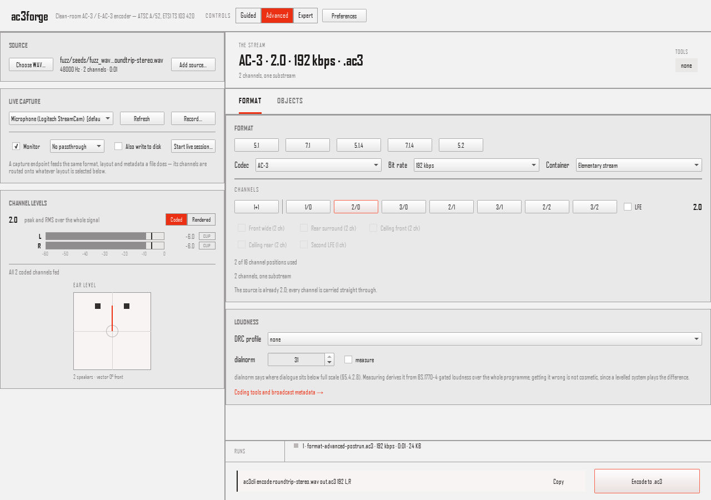
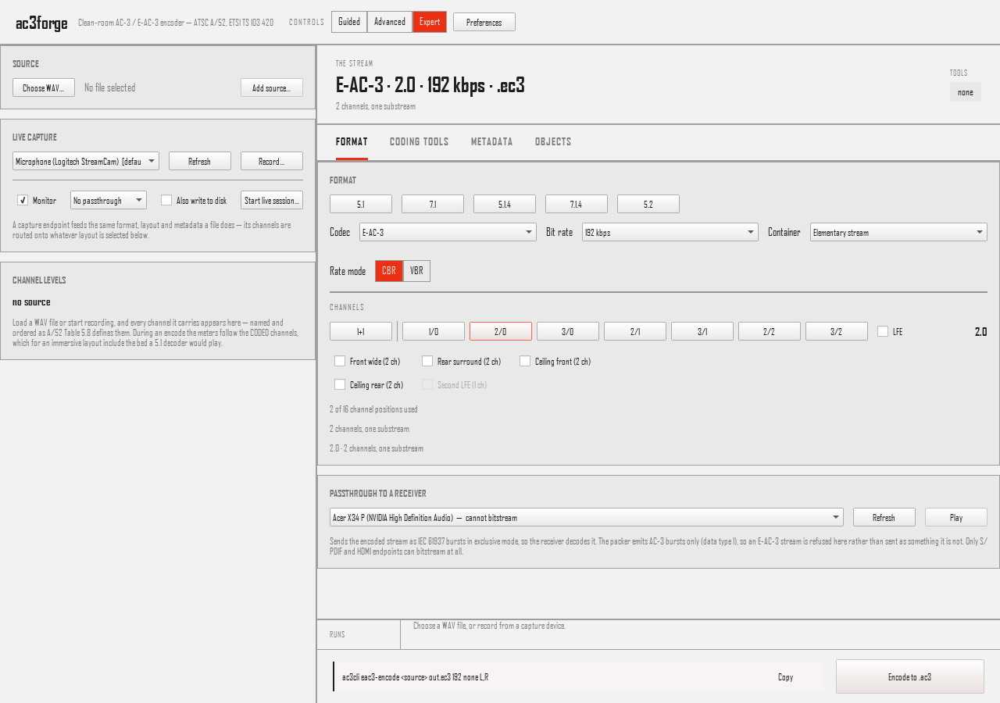

# Format & channels

The Format tab is the one tab always present, in every tier — Guided's own Format step is the
same underlying state in wizard clothing; Advanced and Expert show it as a tab. This page
describes the tab; see [Guided, Advanced, Expert](index.md#guided-advanced-expert) for the
wizard's own step-by-step version.

## Codec, presets, bit rate, container

Four controls in a row: **Codec** (AC-3 / E-AC-3), a row of layout **presets** (5.1, 7.1, 5.1.4,
7.1.4, 5.2), **Bit rate**, and **Container** (elementary stream or Matroska). Presets are starting
points, not the model — they set the bed, LFE, and extras together, but the channel picker below
is what the encode plan actually reads:

The plan strip above the tabs updates live: `E-AC-3 · 7.1.4 · 192 kbps · .ec3` (or, in VBR mode,
`quality <n>` instead of the kbps figure — see below), with a summary (`12 speakers from 12 coded
channels · 2 dependent substreams`) and a routing note (`6 source channels rendered onto 7.1.4.
Silent (the source carries nothing that belongs there): Vhl, Vhr, Lts, Rts` when the source is
narrower than the chosen layout) beneath it.

## Rate mode: CBR or VBR

E-AC-3 only, and file output only — the control disappears entirely for AC-3 (no free word count
to vary; `frmsizecod` indexes a fixed table) and during a live session (IEC 61937 passthrough
bursts are fixed-size per access unit, so a live session always runs CBR regardless — see
[Live capture & session](live-session.md#the-vbr-warning)):

**CBR** (the default) is the plain **Bit rate** dropdown above. **VBR** replaces it with a
**Quality** slider, 0 (smallest) to 100 (best) — encoder-relative, not a fixed target, and *not*
linear in bit cost: cost rises steeply above roughly half the range, so a high quality with no
upper bound will often refuse real programme material outright (`FrameError::kInvalidBitrate`)
rather than silently producing an oversized frame. Two checkboxes, **Minimum** and **Maximum**,
each reveal a kbps field when ticked — presence lives on the checkbox, never a sentinel value:
unticked means no bound at all in that direction, not a default one. The line beneath states the
current bounds in words (`no floor · ≤ 640 kbps`). **Bit rate** above still matters in VBR mode —
it keeps feeding the same coupling/spectral-extension band-edge defaults it always has, just not
as a target rate.

A finished VBR run reports what it actually spent, since it has no target: the run strip reads
`VBR q75 · avg 512 kbps (384–704)` instead of a plain `NNN kbps` figure. At the foot of the panel,
a monospace `ac3cli vbr token` readout shows the exact `q:<quality>[,min:<kbps>][,max:<kbps>]`
string that reproduces the current setting on the command line — see
[CLI → Metadata options](../cli/metadata-options.md#the-vbr-token-eac3-encode-only) for the full
grammar.

## Channels: bed and extras

Two tiers, side by side:

1. **Bed — pick one.** Eight buttons: `1+1` (dual mono), drawn apart from the other seven with a
   rule, then `1/0` through `3/2`, plus an LFE checkbox.
2. **Extras — added to the bed.** Six checkboxes, each Dolby Digital Plus only: front wide, rear
   surround, ceiling front, ceiling middle, ceiling rear, and a second LFE. Paired checkboxes
   toggle together (you can't add a left ceiling channel without its right pair). A budget counter
   (`12 of 16 channel positions used`) tracks how much of Table E2.5's channel space is spent.

`1/0` through `3/2` are the Table 5.8 layout every AC-3 and E-AC-3 stream carries no matter what
else is added; switching the codec to plain AC-3 disables every extra — Dolby Digital carries any
of those seven beds, with or without LFE, but no extras, which is why 3/2+LFE (5.1) is its widest
layout. Everything wider needs the dependent substreams that only E-AC-3 has — see
[Encoding E-AC-3](../library/encoding-eac3.md) for what that means underneath.

### Dual mono

Not a speaker layout at all — two independent, single-channel programmes sharing one syncframe
(§5.4.2's "1+1 dual mono"), selecting it locks out the extras and the independent LFE checkbox
(there's no soundfield for either to describe) and the room-plan-style soundfield view is replaced
with a note explaining why:

The two programmes' channels come from either one two-channel WAV (Ch1/Ch2 = channels 0/1) or two
mono files loaded as separate sources with `p1`/`p2` assignments (see
[Multi-source & assignment](source-assignment.md)) — the same two forms `ac3cli encode`'s `1+1`
layout takes. Each programme gets its own **dialnorm** on the [Metadata tab](metadata.md#loudness)
(`dialnorm2` for Ch2), since the two never share a downmix to average loudness across; automatic
`dialnorm=auto` measurement is not yet supported for dual mono, so both have to be set by hand.

## Channels tab visibility by tier

**Advanced** adds a **Loudness** card here (DRC profile and dialnorm only — the rest of
[Metadata](metadata.md) lives on its own tab in Expert). **Expert** adds a
**Passthrough to a receiver** card instead, letting you send the encode straight to an IEC 61937
device once it's done:

The passthrough device dropdown lists render endpoints and whether each can bitstream at all — an
E-AC-3 stream is refused there outright, since the packer only emits AC-3 bursts (data type 1).
See [Live capture & session](live-session.md) for the live equivalent of this card, and
[Platform notes](../platforms/windows.md) for which platforms have this hardware-confirmed.

## Next

- [Multi-source & assignment](source-assignment.md) — routing more than one loaded file onto this
  same bed.
- [Coding tools](coding-tools.md) — Annex E tools, Expert + E-AC-3 only.
- [Metadata](metadata.md) — the rest of the loudness/downmix picture, Expert only.
- [Objects & motion](objects-and-motion.md) — turning this same bed into an Atmos carrier.
