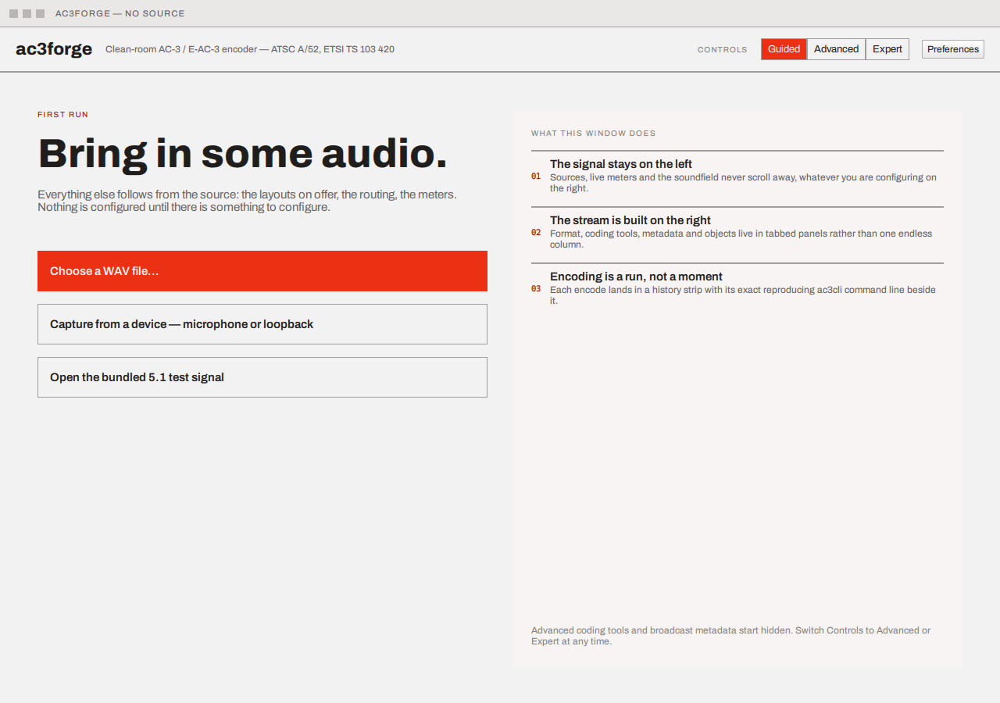
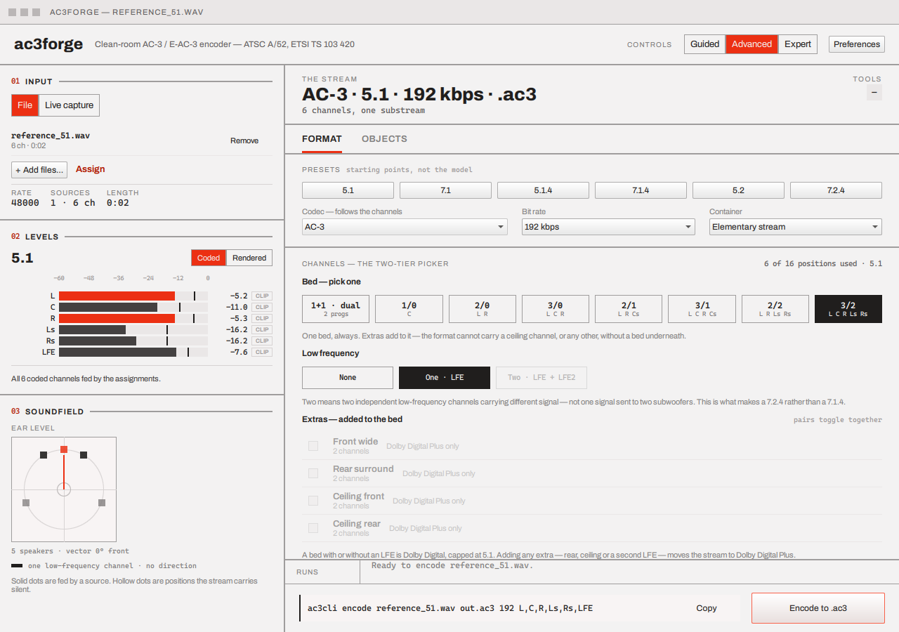
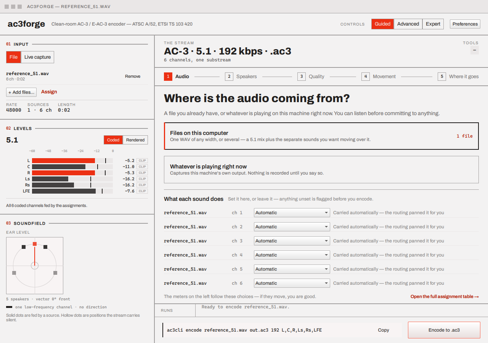

# ac3gui — window layout

`ac3gui` (window title `ac3forge`, QML module `Ac3Forge`) is a Qt Quick front end over the same
`ac3::forge` library documented under [Library](../library/index.md) — nothing in the GUI has
logic the library doesn't also expose, and every setting it makes maps onto an equivalent
[`ac3cli`](../cli/index.md) invocation shown live at the bottom of the window.

The screenshots in this guide are of the current two-pane "workbench" layout, drawn in the
Modernist design system's light palette (a dark theme is derived from the same tokens and follows
the OS, or the Theme preference — see [Preferences](#preferences)). Earlier builds — a nine-card
single-column design, and a first cut of the workbench before the design handoff was fully
implemented — are superseded; if you find references to either elsewhere in the repo's history,
they predate this guide.

## First run

Until a source has ever been chosen, the window shows a first-run screen instead of the workbench
— three ways in (a WAV file, a capture device, or a bundled 5.1 test signal the app synthesises
on the spot) and a one-sentence tour of the window:

## The window

Minimum size 1280×900. Two panes, divided by a vertical rule:

- **Header** (top): the `ac3forge` wordmark and subtitle, a **Guided / Advanced / Expert**
  segmented control, and a **Preferences** button.
- **Left rail — "the signal"** (always visible, never scrolled away, and never affected by which
  tier is selected): three numbered blocks — **01 Input** (one input, with a **File / Live
  capture** selector, the loaded source list and its totals), **02 Levels** (the channel meters),
  and **03 Soundfield** (the plan views). This is what's coming *in* — see
  [Loading a source](loading-a-source.md).
- **Right panel — "the stream"**: a plan strip showing the derived output headline
  (`<codec> · <shape> · <bitrate> kbps · .<suffix>`, or `quality <n>` in VBR mode, or
  `5.1 bed + <n> objects` in object mode), a sub-line counting speakers, coded channels and
  dependent substreams, and the Annex E tools token on a chip. Beneath it, a tab bar (hidden in
  Guided, which fills the panel with its own steps) — tabs carry a badge counting their
  non-default settings, so a collapsed panel still declares itself.
- **Run strip** (bottom): past and in-flight encode runs, a live-generated `ac3cli` command line
  with a Copy button, and the primary Encode button. Present in every tier, including Guided —
  a codec developer must always be able to get back to a command line from what the UI shows.

## Guided, Advanced, Expert

- **Guided** (the default for a new session) replaces the tabbed right panel with a five-step
  sequence — **Audio**, **Speakers**, **Quality**, **Movement**, **Where it goes** — that reads
  and writes the exact same state Advanced and Expert do. There is no separate "wizard draft":
  switch tiers mid-session and whatever guided set is exactly what Advanced or Expert already
  show for the same field, and vice versa.

  

  Guided is not a dead end and not a reduced feature set: step 1 carries its own **What each
  sound does** list — the same per-channel destination dropdowns as the
  [full assignment table](source-assignment.md), in plain language — and a jump to that table
  with a lossless **Back to guided** return. Step 2's speaker cards can open a **room picker**
  sub-screen (say what's *in the room*; the channel layout falls out of the parts). Step 4's
  movement cards drive [object mode](objects-and-motion.md), with trajectory presets that author
  real keyframes. Constraints apply the same way as everywhere else — they are explained rather
  than hidden (turning movement on says it fixed the bed at 5.1, rather than silently locking
  controls elsewhere).
- **Advanced** shows a tabbed right panel — [Format](format-and-channels.md) (presets, the
  channel picker, routing, the assignment table, a Loudness section) and
  [Objects](objects-and-motion.md).
- **Expert** adds the [Coding tools](coding-tools.md) and [Metadata](metadata.md) tabs (Metadata
  absorbs the Loudness section, so it appears exactly once). [Live session](live-session.md)
  joins the tab bar in any tier, but only while a session is actually running — it doesn't exist
  otherwise.

Switching tiers never discards anything already set — it only changes what's visible (and, for
Guided, how it's presented: one question at a time instead of a page of controls). Leaving Expert
while a tab only it shows is current falls back to Format rather than showing an empty panel.

## Preferences

A real dialog, persisted across sessions (QSettings): the theme (Light / Dark / System), which
meter rows to show by default ([Coded / Rendered](loading-a-source.md#channel-levels)), which
Controls tier the app opens on (including "whatever I used last"), whether the `ac3cli` command
line stays visible, and the defaults a new encode starts from (container, rate mode, bit rate,
VBR quality, DRC profile, measure loudness). The codec is deliberately **not** a default — it
follows the channels (see [Format & channels](format-and-channels.md)), and a stale default would
contradict that.

## Next

Walk the panes in the order a first encode actually goes:

1. [Loading a source](loading-a-source.md) — pick a WAV (or several), or capture live; watch the
   channel meters
2. [Format & channels](format-and-channels.md) — layout, dual mono, VBR, bit rate, container —
   and the assignment table everything else derives from
3. [Coding tools](coding-tools.md) — Annex E tools (Expert, E-AC-3 only)
4. [Metadata](metadata.md) — loudness, downmix, heavy compression (Expert)
5. [Objects & motion](objects-and-motion.md) — Dolby Atmos objects
6. [Live capture & session](live-session.md) — capture → encode → monitor/passthrough, live

Loading more than one source at once — each channel individually assigned to a bed position, an
object, or a dual-mono programme — is its own page:
[Multi-source & assignment](source-assignment.md).

Or start with [Concepts](../concepts/index.md) if terms like "dependent substream" or "JOC" are
unfamiliar — the GUI uses the same vocabulary as the standards it implements.
