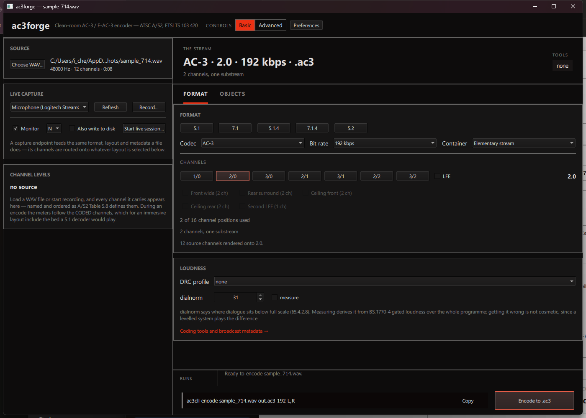
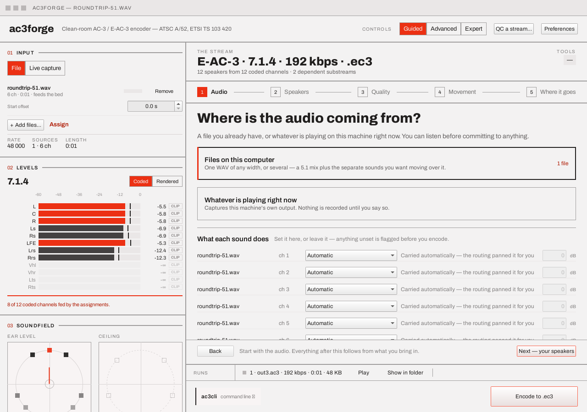

# Loading a source

The left rail — "the signal" — is where audio comes in. Three numbered blocks, always visible
regardless of which tab is active on the right.

## 01 · Input

One input, with a **File / Live capture** selector at the top — there aren't separate cards for
the two any more, because they are the same thing to the encoder: a list of sources whose
channels get routed onto the plan.

### File

**Choose WAV…** opens a file picker. Each loaded source gets a row — filename, channel count,
duration, what its channels *do* (`feeds the bed`, `2 objects · 4 to the bed`, `unassigned` —
derived from the same assignment rows the table edits, so the rail and the table can never
disagree), a numeric **Start offset** field, and a **Remove** button — and a totals strip beneath
the list sums the session (`RATE 48 000 · SOURCES 2 · 8 ch · LENGTH 0:02`):

The row reports the channel *count*, not a layout name — the output layout is chosen
independently on the [Format tab](format-and-channels.md) and need not match the source. A source
narrower than the chosen output layout leaves the missing channels silent; a wider one folds down
per §7.8 using the centre/surround downmix levels on the [Metadata tab](metadata.md), *unless*
more than one source is loaded — see below.

**Start offset** delays a source's own channels by that many seconds of leading silence — all of
them shift together, encoded exactly as `ac3cli`'s `offset=` token would (see
[CLI → Metadata options](../cli/metadata-options.md)), never as a change to the audio itself. It
is the same field the Objects tab's timeline shows as a draggable clip band (see
[Objects & motion](objects-and-motion.md#per-source-offsets-and-keyframe-timing)) — editing either
one moves the other. The totals strip's `LENGTH` grows to cover it: once any offset is set, it
reads `max(offset + duration)` over every source, not just the longest source's own raw length,
so a source pushed out further is never implied to have been cut short.

**+ Add files…** appends another WAV rather than replacing the primary — every source must share
a sample rate, or the add is refused with a status message naming the mismatch. With two or more
sources loaded, automatic fold-down no longer applies: every loaded channel needs an explicit
destination in the [assignment table](source-assignment.md), which the **Assign** link beside the
button jumps to.

### Live capture

A dropdown of capture endpoints — microphones and playback-device loopbacks, the system default
marked `[default]` — plus **Refresh** and two ways to run right here:

- **Monitor** starts a live session that writes *nothing* — no filename is asked for, the meters
  and soundfield run against the real encoded-and-decoded-back signal, an accent square and a
  `monitoring 12.4 s` readout count it, and the button becomes **Stop**. Checking the signal
  never commits to a take, never opens a run entry, and never steals the tab you are
  configuring. With the [capture preference](index.md#preferences) on (it is by default), simply
  choosing a device in the dropdown starts monitoring on its own.
- **Record…** captures to a file (the button becomes **Stop** with a live elapsed readout). By
  default it writes straight to the output folder under a timestamped take name following the
  naming pattern — the status line and run strip say where; a
  [capture preference](index.md#preferences) makes it ask for a filename first instead.

Setting up a *real* session — writing the take to disk, adding a receiver leg, or both — is not a
control on this block any more. It happens on the **Live session** tab, whose own Card covers the
take's idle and running states, the durability guarantees behind an incremental write, the
device-drop watchdog, and the VBR note that used to sit here and now sits there instead — see
[Live capture & session](live-session.md) for all of it.

A capture endpoint feeds the encoder the same way a file does — same format, same layout, same
metadata — its channels are just routed onto whatever layout is selected, live, instead of read
from disk.

!!! note "Platform backend"
    Live capture needs the platform's audio backend (WASAPI on Windows, ALSA on Linux). See
    [Platform notes](../platforms/windows.md) for what's actually hardware-confirmed on each OS —
    the block reports itself unavailable on a build with no backend, rather than failing to load.

## 02 · Levels

One meter row per **coded** channel of the current *plan* — named and ordered as A/52 Table 5.8
and its Annex E extensions define them, under a −60…0 dB scale, with the layout's shape name as
the block's headline:

**The meters follow the plan, not just the file.** Loading a source renders it through the actual
routing in the background and publishes whole-programme peak/RMS per coded channel, so a bed
click, an extras tick or an [assignment](source-assignment.md) edit answers with real numbers — a
channel the routing feeds carries its true level, and a channel nothing feeds is drawn at reduced
opacity reading `-∞`, so "correctly silent" stays distinguishable from "meter wired to nothing."
The footer counts the same fed set the soundfield dots use (`8 of 12 coded channels fed by the
assignments.`), on an accent rule whenever something is carried silent.

A **Coded / Rendered** toggle switches between every transmitted channel (silent ones included)
and only what a receiver actually drives — the two differ whenever a dependent substream's own
channels replace part of the bed (§E3.8.2), and in object mode, where the bed is what the objects
are panned onto. During a run, a red dot and the word **live** appear beside the headline while
metering updates in real time (~30 snapshots/sec); once the run finishes, the bars settle on the
exact whole-file peak/RMS, with per-channel **CLIP** indicators.

## 03 · Soundfield

Two square plan views — **Ear level** and, whenever the plan carries height channels, **Ceiling**
(a flat ring can't show a ceiling layer, so there are two rings) — each scaling to half the
rail's width rather than pinning at a thumbnail. One dot per position at its real angle: **solid
when a source feeds it, hollow when the stream carries it silent**, each dot brightening with
its own live level, plus the energy vector the analysis layer computes. Mono draws too — one dot
at centre is a true statement about where the sound sits; only dual mono has genuinely nothing
to draw. The LFE is stated, not drawn — it has no direction, so a caption beneath the rings
reads `one low-frequency channel · no direction` (or `two independent low-frequency channels` on
a 7.2.4) instead of a dot pretending it has a place.

A `1+1` dual-mono bed replaces the plans entirely with two named programme cards — dual mono has
no soundstage to draw (see [Dual mono](format-and-channels.md#dual-mono)).

## Next

[Format & channels](format-and-channels.md) — choosing what this source actually gets encoded
into.
