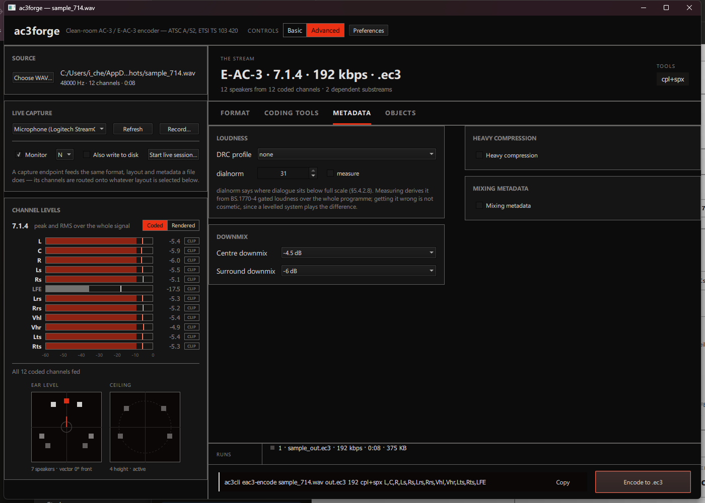

# Metadata

Advanced mode only — Basic mode folds the Loudness half of this onto the
[Format tab](format-and-channels.md#codec-presets-bit-rate-container) instead and leaves the rest
at their defaults.

## Loudness

- **DRC profile** — `none` plus five profiles (`film-standard`, `film-light`, `music-standard`,
  `music-light`, `speech`), §7.7.1.
- **dialnorm** — a 1–31 spin box, disabled by a **measure** checkbox that derives it instead from
  BS.1770-4 gated loudness over the whole programme (§5.4.2.8). Getting it wrong isn't cosmetic —
  a levelled playback system plays the difference.

## Downmix

**Centre downmix** and **Surround downmix** dropdowns — Table 5.9 / Table 5.10 — control how a
wide source folds down to a narrower speaker layout.

## Heavy compression

A checkbox that reveals a **ceiling** spin box (in tenths of a dB, so the −0.5 dBFS default
survives) and a **dialogue** spin box — §7.7.2's peak-limited mono downmix, at syncframe
resolution.

## Mixing metadata

E-AC-3 only. A checkbox reveals a preferred stereo downmix mode and an LFE mix level — the
`mixmdate` group, Table E1.2.

Every field on this tab maps directly onto the [Metadata](../library/metadata.md) library page's
config structs, and onto the [CLI's metadata options](../cli/metadata-options.md)
(`drc=`, `dialnorm=`, `cmixlev=`, `heavy`, `mixmeta`, …) — the values entered here and the tokens
on the command line are the same data, just two ways to set it.

## Next

[Objects & motion](objects-and-motion.md) — the Objects tab, where a plain bed becomes an Atmos
carrier.
