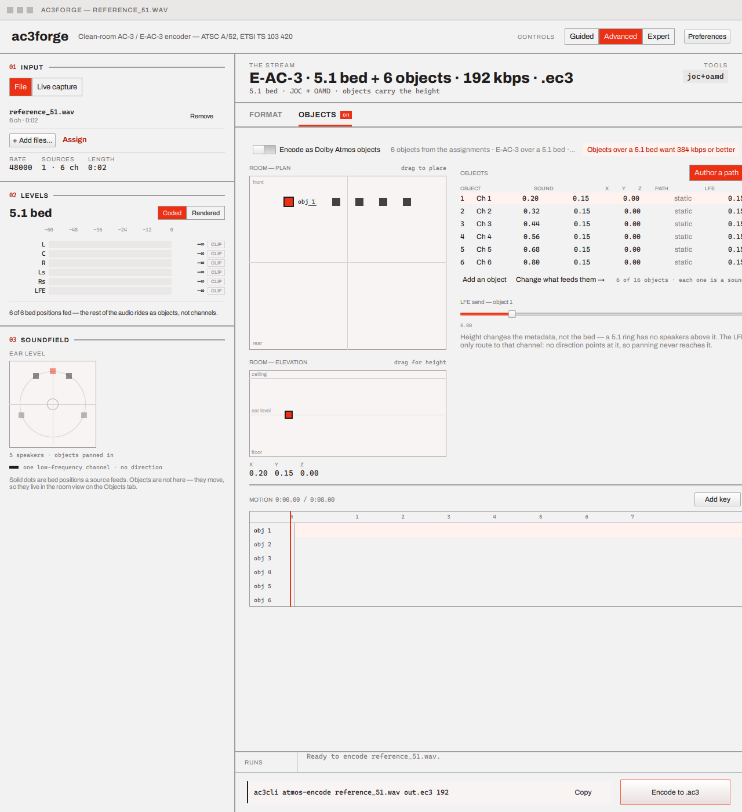

# Objects & motion

The Objects tab is always present in Advanced and Expert, and reachable from Guided too — step 4
(**Movement**) drives the same switch, and its trajectory presets author real keyframes onto the
same objects (see below). The tab starts with a single **Encode as Dolby Atmos objects** switch;
its tab-bar entry carries an `on` badge while it's active. Off, it's out of the way entirely. On,
it takes over the format choice:

Turning it on fixes the codec and layout — objects always ride as JOC + OAMD side data over a
plain 5.1 E-AC-3 bed, so the Format tab's codec field reads *Codec — fixed by object mode*, the
bed picker freezes, and the plan strip reads `E-AC-3 · 5.1 bed + <n> objects · … · .ec3`. If the
bit rate is under 384 kbps, a warning chip appears (`Objects over a 5.1 bed want 384 kbps or
better` — the metadata competes with the audio for the same frame) with a one-click **Set it**
fix, right here rather than on the tab the bit-rate control lives on.

If any of "5.1 bed", "JOC", or "OAMD" aren't already clear, read
[Concepts → Atmos & JOC](../concepts/atmos-joc.md) first — this page assumes that vocabulary.

## Objects come from the assignments

**Which channels ride as objects follows the
[assignment table](source-assignment.md#assigning-channels).** With nothing explicitly assigned,
every loaded channel becomes an object — the sensible default for a file full of stems. Once
anything is explicit, the table is the whole truth:

- A channel assigned **A new object** is a dynamic object, placed and moved in the room.
- A channel assigned to a **bed position** becomes a *static object pinned at that speaker's
  position* — in a JOC stream the bed *is* the panned objects, so "carried as a channel" and "an
  object that never leaves the L speaker" are the same coded thing. The LFE position pins as a
  pure LFE send, since no direction points at it.
- A channel assigned **Nothing** is dropped, with a named warning until that's explicit.

Dynamic objects plus pinned channels together must fit TS 103 420's sixteen-object programme cap
(the bed's LFE is one of the sixteen); an encode over it is refused with the count. An empty
object list (object mode on, nothing assigned to an object) says so — *"Objects come from the
assignments — send a sound to 'an object' and it appears here with a place in the room"* — with
an **Open assignments** button; **Add an object** and **Change what feeds them →** on the tab
itself jump to the same table.

## Room plan, elevation, object list

- **Room — plan** (left): a top-down grid, front/rear. Drag to place the selected object.
- **Room — elevation** (beneath it): a side view with `ceiling`, `ear level` and `floor` marked —
  drag for height, the same gesture as placing in plan. Height changes the *metadata*, not the
  bed: a 5.1 ring has no speakers above it, so two objects at one azimuth and different heights
  are identical in the downmix and only the object layer tells them apart. X/Y/Z readouts sit
  below.
- **Objects** (right): one row per object — number, **Sound** (which loaded channel it is: `Ch
  <n>` with one source, `<file> ch <n>` with several), X/Y/Z, path type (`static`/`path`), LFE
  send, and keyframe count. A count line keeps the budget visible (`6 of 16 objects · each one is
  a sound with a place`). The selected object gets an **LFE send** slider (0.00–1.00) — the only
  route to that channel, since panning never reaches it.

## Motion

A timeline beneath the object list — a ruler over eight seconds, one lane per object with its
keyframes as rotated squares, and a playhead. **Add key** captures the selected object's current
position at the playhead; **Preview** plays every path back in the plan view, moving the markers
along exactly what `encodeObjects` will place (the same `KeyframePath` evaluation, not a second
interpolation that could disagree with it).

Guided step 4 offers **trajectory presets** — *Hold still*, *Slow orbit* (one lap around the
listener over eight seconds, objects spaced apart), *Rise and fall* (floor to ceiling and back) —
that author real keyframes through the same API, so a preset is a starting point on this
timeline, not a separate motion system.

**Author a path / Drive it live** (top right) are the two ways to get motion in. Live driving
needs a monitored capture — the option points at [Live session](live-session.md) rather than
offering a dead control; during a live Atmos session the room is dragged in real time instead of
keyframed.

See [Spatial & Atmos objects](../library/spatial-and-atmos.md) for the `ac3::oba::motion` API
this timeline is a UI over — `Keyframe`, `KeyframePath`, and `evaluate_placements`.

## Next

[Live capture & session](live-session.md) — the same object machinery, but driven from a live
capture instead of a file.
