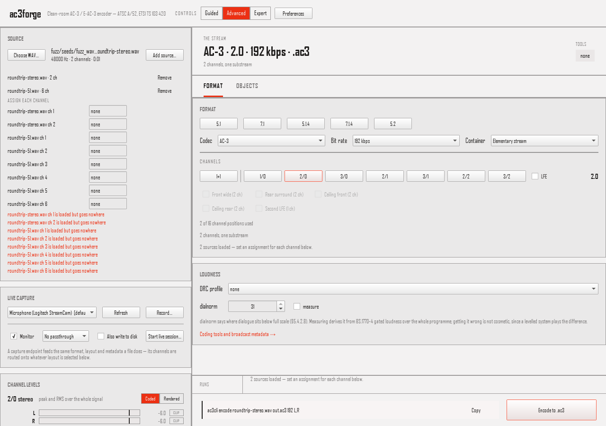

# Multi-source & assignment

**Add source…** (in the [Source card](loading-a-source.md#source), enabled once the first file is
ready) loads a second, third, … WAV alongside the primary rather than replacing it. Every source
must share a sample rate — `plan::render` has no notion of resampling, so a mismatched add is
refused with a status message naming the two rates rather than silently drifting them apart.

With two or more sources loaded, the list and a per-channel assignment table appear on the Format
tab, in Advanced or Expert (Guided's own Source step covers a single file or capture device only —
see [Guided, Advanced, Expert](index.md#guided-advanced-expert)):

## The source list

One row per loaded file — label, channel count, and a **Remove** button. Removing the primary
(the first row) drops every other source and the assignment table with it: there's no honest way
to guess which remaining source should be promoted to primary in its place. Removing any other
source clears the assignment table instead of trying to shift its rows down — a row addressed a
*position* (source index, channel index), every later source's index just changed, and guessing
which old row survives at its new position is exactly the kind of silently-maybe-wrong behaviour
this table exists to avoid. The same reasoning applies to [Objects](objects-and-motion.md): a
non-primary removal resets object placements and authored motion rather than risk one silently
reattaching to a different channel that now sits at the same index.

## Assigning channels

One row per (source, channel) pair — `<file> ch <n>` — with a free-text destination field. Typing
a token and pressing Enter (or clicking away) sets it; the accepted vocabulary is exactly
`ac3cli`'s own `map=` grammar (see [CLI → Commands](../cli/commands.md)):

| Token | Destination |
|---|---|
| A Table E2.5 location name (`L`, `R`, `C`, `LFE`, `Ls`, `Rs`, `Lrs`, `Rrs`, `Vhl`, `Vhr`, …) | That speaker position on the bed currently selected |
| `obj` | An Atmos object (Objects tab must be in object mode) |
| `p1` / `p2` | Programme 1 / Programme 2 of a `1+1` dual-mono bed |
| `none` | Explicitly nowhere — silences the "goes nowhere" warning for this channel without assigning it |

A channel typed as anything else, or left untouched, shows **"`<file>` ch `<n>` is loaded but goes
nowhere"** beneath the table — every loaded channel needs an explicit destination once more than
one source is in play, since automatic single-source panning has no defined meaning across
several files. Two rows naming the same location, or more than one row per dual-mono programme, is
rejected the same way the encoder itself would refuse it.

With exactly one source loaded, none of this appears — the existing automatic panning (a source's
channels routed onto the selected bed by direction, the same way it has always worked) still
applies, and the plain path/summary line on the Source card is all there is to see.

## Next

[Format & channels](format-and-channels.md) — the bed and extras every assigned location name
above has to match.
